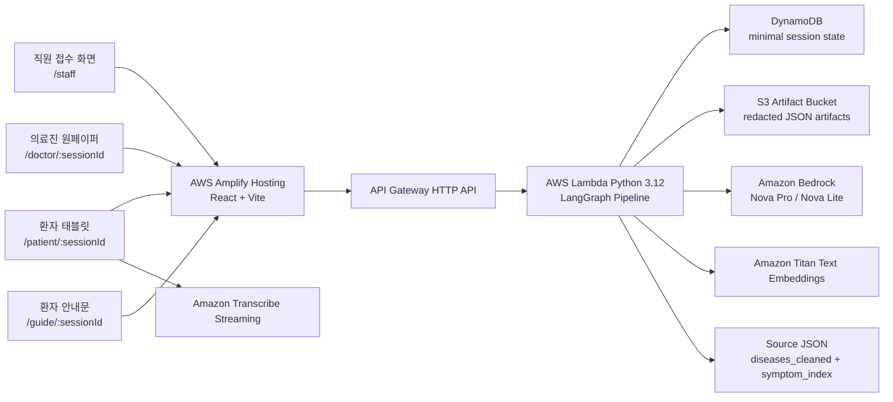

# 문진톡톡 (MunjinTalkTalk)

문진톡톡은 고령 환자의 음성 문진을 진료 전 의료진 원페이퍼와 진료 후 환자 안내문으로 연결하는 AI 문진 MVP입니다.

접수처 직원이 환자 문진 세션을 생성하면, 환자는 태블릿에서 음성으로 문진에 답합니다. 백엔드는 환자 발화를 구조화하고, 표준 증상 매칭과 검증을 거친 뒤 의료진이 빠르게 확인할 수 있는 원페이퍼를 만듭니다. 진료 후에는 의사가 환자 질문에 답변하고 강조사항을 남기면, 환자에게 보여줄 안내문 화면을 생성합니다.

이 저장소는 화면 목업만 담은 저장소가 아닙니다. React/Vite 프론트엔드, AWS 서버리스 백엔드, Amazon Transcribe Streaming, Amazon Bedrock 기반 LLM 파이프라인, Pydantic 스키마 검증, LangGraph 처리 흐름, BM25 + Titan Embedding 기반 Hybrid IR, DynamoDB/S3 하이브리드 저장 구조를 포함합니다.

문진톡톡은 진단, 처방, 질병 예측을 수행하지 않습니다. 환자 발화를 의료진이 확인하기 쉬운 형태로 정리하는 진료 보조 도구이며, 최종 판단은 반드시 의료진이 수행해야 합니다.

---

## 1. 현재 구현 상태

| 영역 | 상태 | 설명 |
| --- | --- | --- |
| 직원 접수 화면 | 구현 | 환자 정보 입력, 초진/재진 선택, 문진 세션 생성 |
| 환자 태블릿 문진 | 구현 | 음성 문진, STT 결과 확인, 동의 모달, 직원 도움 요청 |
| Amazon Transcribe Streaming | 구현 | 음성 파일을 S3에 저장하지 않고 실시간 전사 |
| Bedrock LLM extraction | 구현 | 문항별 환자 발화를 fixed schema로 구조화 |
| Pydantic schema validation | 구현 | 타입, enum, 필수 필드, extra field, source_quote 검증 |
| LangChain | 구현 | PromptTemplate, Bedrock Runnable, JSON parser를 묶은 LLM 호출 chain |
| LangGraph | 구현 | 문항 처리 노드, 분기, trace를 명시적으로 구성 |
| RAG 참고 컨텍스트 | 구현 | 원천 JSON과 제한 alias bridge를 LLM extraction 앞단에 약한 참고 문맥으로 제공 |
| 도메인팩 | 구현 | 호흡기계 증상 slot, alias, safety flag, 기본 질문 문구를 `domain_pack_respiratory.json`로 분리 |
| Hybrid IR | 구현 | BM25 + Titan Vector + label bridge 기반 표준 증상 매칭 |
| 의료진 원페이퍼 | 구현 | 증상, 원문 quote, 문진 맥락, 확인 항목, EMR 초안 표시 |
| 환자 안내문 | 구현 | 의사 답변과 강조사항 기반 안내문 표시 |
| DynamoDB/S3 하이브리드 저장 | 구현 | DynamoDB는 상태와 pointer, S3는 가명처리 artifact 저장 |
| 인증/권한 분리 | MVP 범위 밖 | 공개 테스트 전 별도 설계 필요 |
| 실제 EMR 연동 | MVP 범위 밖 | 병원 시스템 연동 단계에서 검토 |
| 강원 방언 RAG | 계획 | 추후 국립국어원/방언 사전 기반 retriever로 확장 예정 |

---

## 2. 사용자 흐름

```text
직원 접수
  -> 환자 태블릿 서비스 이용 동의
  -> 환자 음성 문진
  -> Transcribe Streaming 전사
  -> 환자 STT 결과 확인
  -> 원천 JSON 기반 RAG 참고 컨텍스트 검색
  -> Bedrock LLM extraction
  -> Pydantic schema/source_quote 검증
  -> 검증 실패 시 LangGraph retry loop
  -> Hybrid IR 표준 증상 매칭
  -> S3 artifact 저장, DynamoDB 상태 갱신
  -> 의료진 원페이퍼 확인
  -> 의사 답변 및 환자 강조사항 입력
  -> 환자 안내문 생성 및 출력
```

### 직원 접수

접수처 직원은 `/staff` 화면에서 환자 문진 세션을 생성합니다.

입력되는 값:

- 이름
- 생년월일
- 성별
- 진료과
- 담당 의사
- 연락처
- 초진/재진 여부

백엔드는 이 값을 그대로 저장하지 않습니다. 세션 생성 시 실명은 마스킹 표시명으로 변환하고, 생년월일은 나이와 연령대로 변환하며, 연락처 원문은 저장하지 않습니다.

### 환자 태블릿

환자는 `/patient/:sessionId` 화면에서 문진을 진행합니다. 문진 시작 전 서비스 이용 동의 모달을 확인하고 동의해야 음성 문진으로 이동합니다.

현재 문진 문항:

| 구분 | 문항 | 목적 |
| --- | --- | --- |
| 초진 Q1 | 어디가 불편하셔서 오셨어요? | 주호소와 주요 증상 추출 |
| 초진 Q2 | 그 증상은 언제부터 그러셨어요? | 시작 시점과 경과 문맥 추출 |
| 초진 Q3 | 지금 드시는 약이 있으세요? | 복약, 영양제, 한약 등 확인 |
| 초진 Q4 | 의사 선생님께 묻고 싶은 점이 있으세요? | 환자 질문 agenda 분리 |
| 재진 Q1 | 지난번 진료 이후 어떻게 지내셨어요? | 증상 변화와 경과 확인 |
| 재진 Q2 | 처방받은 약은 잘 드시고 계세요? | 복약 순응도 확인 |
| 재진 Q3 | 그동안 새로 생긴 증상은 없으세요? | 새 증상, 악화, 위험 표현 확인 |
| 재진 Q4 | 지난번과 비교해서 묻고 싶은 점이 있으신가요? | 추가 질문 분리 |

### 의료진 원페이퍼

의료진은 `/doctor/:sessionId`에서 다음 정보를 확인합니다.

- 오늘 말한 불편함
- 환자 원문 quote
- 표준 증상 매칭 여부
- 문진 맥락 chip
- 의료진 확인 항목
- 환자 질문 및 답변 입력 영역
- EMR 복사용 문장
- 환자 안내 강조사항

증상 카드에는 의료진이 진단 확률처럼 오해할 수 있는 숫자 점수를 표시하지 않습니다. 운영용 onepaper JSON에도 점수와 후보 목록을 저장하지 않고, UI에는 “매칭됨” 또는 “우선 확인”처럼 확인 중심 상태만 표시합니다.

### 환자 안내문

의사가 환자 질문에 답하고 강조사항을 입력하면 `/guide/:sessionId` 화면에서 환자 안내문을 확인할 수 있습니다.

- 의사 답변을 어르신이 읽기 쉬운 문장으로 정리
- 의사가 직접 적은 강조사항은 LLM이 바꾸지 않고 그대로 표시
- 말로 재생하기 버튼 제공
- 종이 출력 화면 제공

---

## 3. 기술 아키텍처



### 프론트엔드

- React + Vite
- Amplify Hosting 배포
- 접수처, 환자 태블릿, 의사 대기열, 원페이퍼, 안내문 화면을 하나의 SPA로 제공
- 환자 음성은 브라우저에서 Transcribe Streaming WebSocket으로 전송
- 백엔드의 원페이퍼 JSON을 UI에 맞게 정규화하여 표시

### 백엔드

- AWS API Gateway HTTP API
- AWS Lambda Python 3.12
- DynamoDB 세션 상태 저장
- S3 artifact 저장
- Amazon Bedrock Nova Pro / Nova Lite
- Amazon Titan Text Embeddings
- Pydantic schema validation
- LangChain Runnable 기반 Bedrock JSON chain
- LangGraph pipeline

---

## 4. AI 처리 원칙

문진톡톡은 LLM이 모든 판단을 독단적으로 수행하는 구조가 아닙니다.

| 단계 | 기술 | 역할 | 통제 |
| --- | --- | --- | --- |
| 음성 인식 | Amazon Transcribe Streaming | 환자 음성을 한국어 텍스트로 전환 | 음성 원본 파일 저장 없음 |
| RAG 참고 컨텍스트 | 로컬 reference retriever | 원천 JSON과 제한 alias bridge에서 표준화 참고 문맥 검색 | 환자 사실로 직접 채택하지 않음 |
| 의미 추출 | Bedrock Nova Pro/Lite | 문항별 발화를 schema에 맞게 구조화 | Pydantic, enum, source_quote 검증 |
| LLM 호출 chain | LangChain Core | PromptTemplate, Bedrock Runnable, JSON parser 구성 | chain meta와 parser 경로 추적 |
| 파이프라인 제어 | LangGraph | 노드 순서, RAG, parser/validator, retry 분기, trace 관리 | 최소 active_path와 node event만 감사 trace에 저장 |
| 증상 매칭 | BM25 + Titan Vector Hybrid IR | LLM 증상 후보를 표준 증상명과 매칭 | 운영 artifact에는 점수 제거, 감사 trace에는 확정 근거만 요약 |
| 원페이퍼 리뷰 | Bedrock Nova Pro | 의료진 확인 항목과 EMR 초안 보강 | review schema 검증 |
| 안내문 변환 | Bedrock Nova Lite | 의사 답변을 환자용 안내문으로 변환 | guide schema 검증 |

중요 제한:

- LLM이 만든 임의 `score`, `confidence`, `probability` 값은 사용하지 않습니다.
- `source_quote`는 환자 원문에 실제 존재해야 합니다.
- 스키마에 없는 JSON 필드는 거부합니다.
- 증상 `slot_ref`, 안전 플래그, alias hint, fallback 질문 문구는 도메인팩에서 읽습니다.
- 증상 매칭은 LLM 단독 판단이 아니라 원천 JSON 기반 Hybrid IR을 통과해야 합니다.
- RAG 결과는 LLM 표준화 참고 문맥일 뿐, source_quote나 최종 증상 매칭 근거가 아닙니다.
- rule-based extraction fallback으로 LLM 실패를 조용히 대체하지 않습니다.
- validator 실패는 retry 후 실패 응답으로 드러냅니다.

### LangChain과 LangGraph 적용 상태

현재 백엔드는 LangChain과 LangGraph를 문서상 용어로만 쓰지 않고 실제 코드 경로에 포함합니다.

- `backend/serverless/src/langchain_prompting.py`는 `ChatPromptTemplate -> RunnableLambda(Bedrock converse) -> JsonOutputParser` 구조로 LLM 호출 chain을 구성합니다.
- `backend/serverless/src/pipeline_graph.py`는 LangGraph `StateGraph`로 문항 처리 노드와 retry edge를 정의합니다.
- `backend/serverless/src/pipeline_nodes.py`는 RAG 참고 문맥 검색, LLM extraction, Pydantic/source_quote 검증, Hybrid IR, S3 artifact 저장을 각 node 함수로 나눕니다.
- `docs/LANGGRAPH_PIPELINE.md`는 환자 답변 1개가 어떤 노드를 거쳐 처리되는지와 trace가 어디에 남는지를 설명합니다.

---

## 5. Hybrid IR 개요

증상 매칭은 다음 데이터를 사용합니다.

```text
backend/serverless/src/data/diseases_cleaned.json
backend/serverless/src/data/symptom_index.json
backend/serverless/src/data/symptom_embeddings_amazon.titan-embed-text-v2_0_512.json
```

처리 순서:

1. LLM extraction이 증상 후보 span을 생성합니다.
2. span의 `source_quote`, `normalized_text`, `name`, `slot_ref`를 검색 query로 구성합니다.
3. `symptom_index.json`과 `diseases_cleaned.json`에서 검색 문서를 deterministic하게 구성합니다.
4. BM25로 lexical 유사도를 계산합니다.
5. Titan embedding으로 semantic 유사도를 계산합니다.
6. 표준 증상명 또는 제한된 alias bridge가 직접 맞는 경우 label score를 보조 반영합니다.
7. threshold를 통과한 후보만 운영용 `matched_slots`에 남깁니다.
8. 운영용 `answers.redacted.json`과 `onepaper.redacted.json`에는 숫자 점수, 후보 목록, prompt/response 전문을 저장하지 않습니다.
9. 법적·품질 이슈가 생겼을 때를 위해 `llm_trace.redacted.json`에는 실행 노드, 사용 모델, validator 통과 여부, 확정 IR 근거 요약만 남깁니다.

의료진 UI와 운영 onepaper에는 숫자 점수를 직접 노출하지 않습니다. 숫자는 IR 내부 계산과 최소 감사 trace의 근거 요약에만 제한적으로 사용합니다.

---

## 6. 저장 구조와 보안 원칙

현재 MVP는 DynamoDB와 S3를 분리해서 사용합니다.

| 저장소 | 저장하는 값 | 저장하지 않는 값 |
| --- | --- | --- |
| DynamoDB | `session_id`, 대기 순번, 상태, 마스킹 환자명, 연령대, 성별, 진료과, S3 artifact key | 실명, 생년월일, 연락처, 문항별 원문, 원페이퍼 전체, 환자 안내문 |
| S3 artifact bucket | 가명처리된 운영 artifact와 최소 설명 trace: `answers.redacted.json`, `onepaper.redacted.json`, `doctor_review.redacted.json`, `patient_guide.redacted.json`, `llm_trace.redacted.json` | 음성 원본 파일, prompt 전문, LLM raw response, 전체 후보 목록 |

음성 원본 파일은 저장하지 않습니다. 브라우저가 Amazon Transcribe Streaming으로 음성을 직접 전송하고, 확정된 텍스트만 백엔드 파이프라인으로 전달합니다.

상세 보안 기준은 [docs/SECURITY_DATA_INVENTORY.md](docs/SECURITY_DATA_INVENTORY.md)를 참고합니다.

---

## 7. 저장소 구조

```text
munjin-talk-talk-mvp/
├── README.md
├── amplify.yml
├── frontend/
│   ├── README.md
│   ├── package.json
│   └── src/
│       ├── App.jsx
│       ├── components/
│       ├── hooks/
│       ├── services/
│       ├── config/
│       └── styles/
├── backend/
│   ├── README.md
│   └── serverless/
│       ├── README.md
│       ├── template.yaml
│       └── src/
│           ├── handler.py
│           ├── artifact_store.py
│           ├── privacy.py
│           ├── pipeline_graph.py
│           ├── pipeline_nodes.py
│           ├── rag_context.py
│           ├── extraction_prompts.py
│           ├── extraction_schema.py
│           ├── retrieval.py
│           ├── onepager.py
│           ├── guide.py
│           ├── schemas/
│           └── data/
└── docs/
    ├── README.md
    ├── PROJECT_STRUCTURE.md
    ├── LANGGRAPH_PIPELINE.md
    ├── DATA_SCHEMA.md
    ├── SECURITY_DATA_INVENTORY.md
    ├── MVP_SETUP.md
    ├── DEPLOYMENT.md
    ├── architecture.drawio
    ├── architecture.svg
    └── technical-guide.html
```

---

## 8. 문서 읽는 순서

| 문서 | 목적 |
| --- | --- |
| [frontend/README.md](frontend/README.md) | 프론트 화면, 라우팅, STT, API 연동 |
| [backend/README.md](backend/README.md) | 백엔드 책임, LangGraph, LLM, IR, 저장 구조 |
| [backend/serverless/README.md](backend/serverless/README.md) | SAM 배포, API endpoint, 환경 변수, 테스트 |
| [docs/README.md](docs/README.md) | 문서 전체 목차와 권장 읽기 순서 |
| [docs/PROJECT_STRUCTURE.md](docs/PROJECT_STRUCTURE.md) | 파일별 역할과 수정 위치 |
| [docs/LANGGRAPH_PIPELINE.md](docs/LANGGRAPH_PIPELINE.md) | 환자 답변 1개가 처리되는 노드 흐름 |
| [docs/DATA_SCHEMA.md](docs/DATA_SCHEMA.md) | DynamoDB, S3 artifact, extraction, onepaper, guide JSON |
| [docs/SECURITY_DATA_INVENTORY.md](docs/SECURITY_DATA_INVENTORY.md) | 필드별 보안 처리와 DynamoDB/S3 분리 기준 |
| [docs/MVP_SETUP.md](docs/MVP_SETUP.md) | 로컬 실행과 test 환경 점검 |
| [docs/DEPLOYMENT.md](docs/DEPLOYMENT.md) | Amplify와 SAM 배포 절차 |
| [docs/technical-guide.html](docs/technical-guide.html) | 발표와 평가용 시각적 기술 설명 |

---

## 9. 로컬 실행

프론트엔드:

```powershell
cd frontend
npm install
Copy-Item .env.example .env.local
npm run dev -- --host 127.0.0.1 --port 5173
```

브라우저:

```text
http://127.0.0.1:5173/staff
```

AWS 백엔드 연결 시 `frontend/.env.local`:

```text
VITE_API_BASE_URL=https://<api-id>.execute-api.<region>.amazonaws.com
```

---

## 10. AWS 배포 개요

백엔드:

```powershell
cd backend/serverless
sam build
sam deploy --guided
```

`sam deploy --guided`에서 `ArtifactsBucketName`에는 가명처리 문진 산출물을 저장할 S3 bucket 이름을 입력합니다.

프론트엔드 Amplify 설정:

```text
Repository: <owner>/<repository>
Branch: main 또는 test
Monorepo app root: frontend
Build command: npm run build
Build output directory: dist
Environment variable:
  VITE_API_BASE_URL=https://<api-id>.execute-api.<region>.amazonaws.com
```

SPA rewrite:

```json
[
  {
    "source": "/<*>",
    "status": "404-200",
    "target": "/index.html"
  }
]
```

---

## 11. 검증 명령

프론트엔드:

```powershell
cd frontend
npm.cmd run build
```

백엔드 Python syntax:

```powershell
python -m compileall backend/serverless/src
```

SAM template:

```powershell
cd backend/serverless
sam validate
```

Windows에서 PowerShell 실행 정책 때문에 `npm`이 막히면 `npm.cmd`를 사용합니다.

---

## 12. 개인정보와 보안 주의사항

현재 저장소는 연구·시연 목적의 MVP입니다. 실제 환자 데이터로 공개 테스트하기 전 다음 항목이 필요합니다.

- 직원/의사 화면 인증
- 역할 기반 접근 제어
- DynamoDB TTL과 S3 Lifecycle 정책
- S3 Block Public Access
- S3 기본 암호화 또는 KMS
- Macie 민감정보 탐지
- CloudWatch Logs 보존 기간과 원문 로그 금지 정책
- API Gateway throttling
- WAF 또는 접근 제한
- 환자 동의 문구와 개인정보 처리 기준 검토
- Bedrock/Transcribe 데이터 처리 정책 확인

현재 구현에서 환자 음성은 S3에 저장하지 않습니다. DynamoDB에는 대기열과 상태, 마스킹 환자명, S3 artifact key만 저장하고, 문진 텍스트와 원페이퍼/안내문 JSON은 가명처리 후 S3 artifact로 저장합니다.

---

## 13. 공개 저장소 주의사항

저장소에 포함하면 안 되는 항목:

- `.env`, `.env.local`
- AWS access key 또는 secret key
- SAM `samconfig.toml`
- `.aws-sam/`
- `frontend/node_modules/`
- `frontend/dist/`
- 실제 환자 데이터
- 실제 API Gateway endpoint를 고정한 문서
- 실제 S3 bucket 이름이나 AWS account id가 포함된 설정

현재 `.gitignore`는 위 항목 대부분을 제외하도록 구성되어 있습니다.

---

## 14. 팀

| 역할 | 이름 |
| --- | --- |
| 리더 | 최기범 |
| 팀원 | 김원재, 방정호, 서지민, 박나현 |

---

## 15. 면책 조항

문진톡톡은 의료적 진단, 처방, 질병 예측을 수행하지 않습니다. 이 프로젝트는 환자 발화를 구조화하여 의료진 확인을 돕는 MVP이며, 모든 진료 판단은 의료진이 수행해야 합니다.
