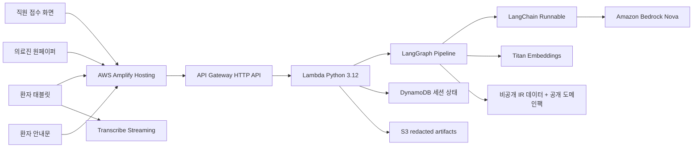

# 문진톡톡 (MunjinTalkTalk)

고령 환자가 말로 답한 문진을 의료진이 바로 확인할 수 있는 진료 전 원페이퍼와 진료 후 환자 안내문으로 정리하는 음성 기반 AI 문진 보조 서비스입니다.

- 배포 URL: [https://main.dv5herezqtt1t.amplifyapp.com](https://main.dv5herezqtt1t.amplifyapp.com)
- 프론트엔드: React 18, Vite, Amazon Transcribe Streaming
- 백엔드: AWS API Gateway, Lambda Python 3.12, DynamoDB, S3, Amazon Bedrock Nova, Amazon Titan Embeddings
- 파이프라인: LangGraph 상태 그래프, LangChain Runnable, Pydantic schema validation, Hybrid IR

> 문진톡톡은 진단, 처방, 질병 예측을 하지 않습니다. 환자 발화를 구조화해 의료진 확인을 돕는 MVP이며, 모든 진료 판단은 의료진이 수행합니다.

---

## 1. 문제 정의

병원 접수 후 진료 전 문진 과정에서 고령 환자는 증상, 시작 시점, 복약 상황, 궁금한 점을 짧은 시간 안에 정리해서 말하기 어렵습니다. 의료진은 진료실에서 같은 질문을 반복해야 하고, 환자가 실제로 묻고 싶었던 질문은 뒤늦게 나오거나 누락됩니다.

문진톡톡은 이 병목을 다음 방식으로 줄입니다.

| 문제 | 서비스 대응 |
| --- | --- |
| 고령 환자가 키보드 입력을 어려워함 | 태블릿 음성 문진과 큰 버튼 UI 제공 |
| 사투리와 비표준 표현 때문에 의미가 흔들림 | 강원 방언 RAG 참고 문맥과 LLM 표준화 사용 |
| LLM이 임의로 진단하거나 확률을 만들 위험 | fixed schema, quote grounding, Hybrid IR, validator로 통제 |
| 의료진이 진료 전 핵심을 빠르게 보기 어려움 | 증상, 원문, 문진 맥락, 확인 항목, 환자 질문을 원페이퍼로 제공 |
| 진료 후 안내가 환자에게 남지 않음 | 의사 답변과 강조사항을 환자용 안내문으로 변환하고 출력 |

---

## 2. 서비스 화면

| 화면 | 경로 | 사용자 | 핵심 기능 |
| --- | --- | --- | --- |
| 직원 접수 | `/staff` | 접수처 직원 | 환자 접수, 초진/재진 선택, 문진 세션 생성, 수동 입력 |
| 환자 태블릿 | `/tablet` 또는 `/patient/:sessionId` | 환자 | 동의, 음성 문진, STT 확인, 직원 도움 요청 |
| 의사 대기열 | `/doctor/queue` | 의료진 | 문진 완료/분석 중/우선 확인 환자 목록 |
| 원페이퍼 | `/doctor/:sessionId` | 의료진 | 증상 매칭, 원문 quote, 문진 요약, 확인 항목, EMR 초안 |
| 안내문 출력 | `/guide/:sessionId` | 환자·직원 | 환자용 안내문, 음성 재생, 인쇄 |

환자 태블릿은 여러 세션이 동시에 대기할 수 있도록 문진 대기열 화면을 제공하며, 환자는 자기 세션을 선택해 문진을 시작합니다.

---

## 3. 최신 처리 흐름

환자 문진 중에는 LLM 분석을 기다리지 않습니다. 환자는 Q1~Q4를 모두 답한 뒤 바로 문진 완료 화면을 보고, 백엔드는 그 뒤에서 분석을 수행합니다.

```text
직원 접수
  -> 환자 세션 생성
  -> 환자 태블릿 대기열 표시
  -> 환자 동의
  -> Q1~Q4 음성 문진
  -> STT 결과 환자 확인
  -> /process-answers 로 답변 일괄 저장
  -> 세션 상태 analysis_pending
  -> 환자 완료 화면 / 태블릿 대기열 복귀

백그라운드 Lambda
  -> LangGraph 파이프라인 실행
  -> 방언 RAG 참고 문맥 검색
  -> Bedrock Nova 표준화/의미 추출
  -> Pydantic schema + source_quote 검증
  -> Hybrid IR 표준 증상 후보 검색
  -> Linker/validator로 최종 증상 확정
  -> 원페이퍼와 최소 trace를 S3에 저장
  -> DynamoDB 상태 waiting_doctor 또는 needs_priority 갱신

의료진
  -> 대기열에서 원페이퍼 확인
  -> 환자 질문에 답변 입력
  -> 환자 안내문 생성 및 출력
```

구버전 호환을 위해 단일 문항 처리 endpoint도 일부 남아 있지만, 실제 프론트 기본 흐름은 Q1~Q4 일괄 저장 후 백그라운드 분석입니다.

---

## 4. 기술 아키텍처




### 핵심 설계 원칙

- LLM은 원문을 구조화하는 도구로만 사용합니다.
- LLM이 만든 임의 점수, 확률, confidence는 저장하거나 UI에 노출하지 않습니다.
- `source_quote`는 환자 원문에 실제로 존재해야 합니다.
- schema에 없는 JSON 필드는 거부합니다.
- 증상 매칭은 LLM 단독 생성이 아니라 BM25, Titan Vector, label signal을 결합한 Hybrid IR을 거칩니다.
- 원페이퍼가 준비되지 않은 상태에서는 의사 화면에서 “분석 중”으로 표시하고 재분석 버튼을 제공합니다.

---

## 5. AI 파이프라인

| 단계 | 구현 | 설명 |
| --- | --- | --- |
| 음성 인식 | Amazon Transcribe Streaming | 음성 파일을 저장하지 않고 텍스트만 확정 |
| 방언 참고 | `dialect_rag.py`, `rag_context.py` | 강원 방언팩에서 표준어 후보 문맥 검색 |
| 의미 추출 | LangChain Runnable + Bedrock Nova | `source_quote`, `normalized_text`, `status`, `symptom_hint` 추출 |
| 검증 | Pydantic schema + quote validator | enum, 필수 필드, 원문 포함 여부 검증 |
| IR 후보 검색 | BM25 + Titan Vector + label signal | 표준 증상 후보 top-k 검색 |
| 최종 연결 | Linker + deterministic validator | 후보 안에서 표준 증상명 확정, 실패 시 no match |
| 원페이퍼 | `onepager.py`, `onepager_review.py` | 의료진 확인 항목과 EMR 초안 구성 |
| 안내문 | `guide.py` | 의사 답변을 환자 친화 문장으로 변환 |

자세한 파이프라인은 [docs/LANGGRAPH_PIPELINE.md](docs/LANGGRAPH_PIPELINE.md)를 참고하세요.

---

## 6. 데이터와 보안

문진톡톡은 공개 저장소와 운영 환경을 분리합니다.

| 저장 위치 | 저장 내용 | 저장하지 않는 내용 |
| --- | --- | --- |
| DynamoDB | `session_id`, 상태, 대기 순번, 마스킹 환자명, 연령대, 성별, S3 artifact key | 실명, 생년월일 원문, 연락처 원문, 문항별 상세 원문 |
| S3 | 가명처리된 `answers.redacted.json`, `onepaper.redacted.json`, `patient_guide.redacted.json`, 최소 trace | 음성 원본, prompt 전문, LLM raw response, 전체 후보 목록 |
| GitHub | 소스 코드, 공개 도메인팩, 질문셋, 샘플 데이터 | 원천 의료 백과 데이터, 파생 증상 인덱스, embedding cache, 실제 평가 데이터 |

운영 AWS 환경에서 적용한 보안 설정:

- HTTPS 기반 Amplify 배포
- 직원/의사 접근 코드 로그인과 만료 세션 토큰
- CORS origin 제한
- API Gateway throttling
- Amplify WAF
- DynamoDB TTL
- S3 lifecycle 3일 삭제
- Macie, CloudTrail, GuardDuty, Security Hub 활성화
- AWS AI Services opt-out 정책 적용

상세 필드 기준은 [docs/SECURITY_DATA_INVENTORY.md](docs/SECURITY_DATA_INVENTORY.md)를 참고하세요.

---

## 7. 실행 방법

### 프론트엔드

```bash
cd frontend
npm install
cp .env.example .env.local
npm run dev -- --host 127.0.0.1 --port 5173
```

`frontend/.env.local`

```text
VITE_API_BASE_URL=https://<api-id>.execute-api.<region>.amazonaws.com
```

### 백엔드

```bash
cd backend/serverless
sam build
sam validate
sam deploy --guided
```

PowerShell 배포 예시는 [backend/serverless/README.md](backend/serverless/README.md)에 정리되어 있습니다.

### 검증

```bash
cd backend/serverless
python -m pytest tests/ -q

cd ../../frontend
npm run build
```

---

## 8. 저장소 구조

```text
munjin-talk-talk/
├── frontend/                 # React + Vite 화면
├── backend/
│   └── serverless/           # SAM 기반 Lambda 백엔드
│       ├── template.yaml
│       ├── src/
│       │   ├── handler.py
│       │   ├── orchestration.py
│       │   ├── pipeline_graph.py
│       │   ├── pipeline_nodes.py
│       │   ├── langchain_prompting.py
│       │   ├── retrieval*.py
│       │   ├── onepager*.py
│       │   ├── guide.py
│       │   ├── schemas/
│       │   └── data/
│       └── tests/
├── docs/                     # 아키텍처, schema, 배포, 보안 문서
└── evaluation/
    └── ir/                   # IR/Linker 평가 코드
```

---

## 9. 문서 안내

| 문서 | 목적 |
| --- | --- |
| [frontend/README.md](frontend/README.md) | 화면 구조, STT, 프론트 API 연동 |
| [backend/README.md](backend/README.md) | 서버 처리 흐름, LangGraph, LLM, IR, 저장 정책 |
| [backend/serverless/README.md](backend/serverless/README.md) | SAM 배포, 환경 변수, AWS 설정 |
| [backend/serverless/src/data/README.md](backend/serverless/src/data/README.md) | 공개 저장소에 없는 런타임 데이터 배치 기준 |
| [evaluation/ir/README.md](evaluation/ir/README.md) | IR 후보 검색과 Linker 성능 평가 |
| [docs/README.md](docs/README.md) | 전체 기술 문서 목록 |

---

## 10. 팀

| 역할 | 이름 |
| --- | --- |
| 리더 | 최기범 |
| 팀원 | 김원재, 방정호, 서지민, 박나현 |

---

## 11. 면책

이 저장소는 X+AI·SW 융합 프로젝트 해커톤 제출용 MVP입니다. 의료 진단, 처방, 치료 결정을 자동화하지 않으며, 환자 발화 기반 문진 정보를 의료진이 확인하기 쉽게 정리하는 데 목적이 있습니다.

원천 의료 백과 데이터와 그 파생 인덱스, embedding cache는 저작권과 이용 범위 검토 대상이므로 공개 저장소에 포함하지 않습니다.
