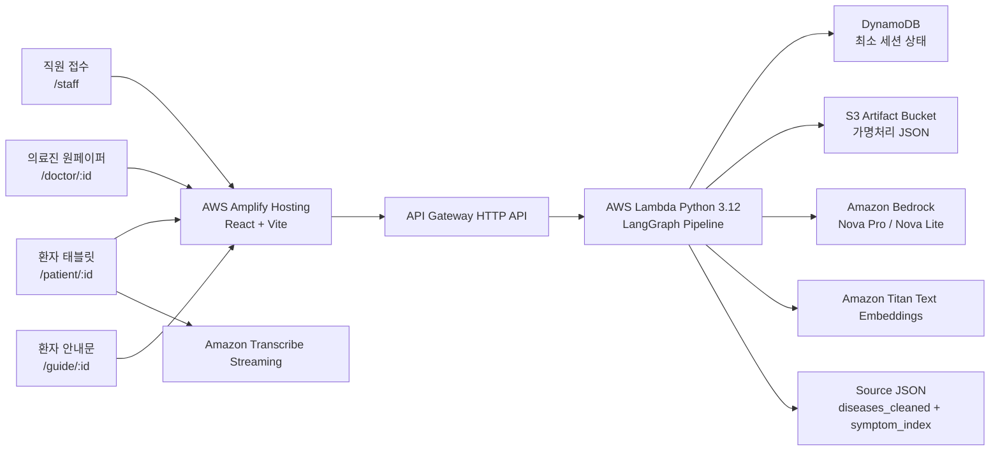

<div align="center">

# 🗣️ 문진톡톡 · MunjinTalkTalk

**고령 환자의 음성 한마디를, 의료진이 30초 안에 읽는 진료 전 원페이퍼로.**

말로 답한 문진을 → 구조화 → 표준 증상 매칭 → 검증을 거쳐, 진료 전엔 *의료진용 원페이퍼*로, 진료 후엔 *환자용 안내문*으로 바꿔주는 AI 문진 보조 MVP


</div>

<!-- ───────────────────────────────────────────────
  HERO: 데모 GIF 1장을 여기에. (태블릿 음성 문진 → 의료진 원페이퍼로 이어지는 10초 클립 권장)
  docs/readme-assets/hero.gif 로 저장 후 아래 주석 해제
─────────────────────────────────────────────── -->
<!-- <div align="center"></div> -->

> ⚠️ **문진톡톡은 진단·처방·질병 예측을 하지 않습니다.** 환자 발화를 의료진이 확인하기 쉬운 형태로 정리하는 *진료 보조 도구*이며, 모든 의료 판단은 의료진이 수행합니다.

---

## 🩺 우리가 푸는 문제

진료실에서 고령 환자와 의료진 사이에는 매일 같은 병목이 반복됩니다.

- **환자는** 증상을 조리 있게 말하기 어렵습니다. 긴장하거나, 사투리·비표준 표현을 쓰거나, 정작 중요한 걸 빠뜨립니다.
- **의료진은** 평균 수 분의 진료 시간 안에서 주호소·발병 시점·복약·환자 질문을 매번 처음부터 캐물어야 합니다.
- 그 결과 **핵심 정보가 누락되고, 진료 시간은 정보 수집에 쓰이며**, 환자는 정작 묻고 싶었던 질문을 못 한 채 진료실을 나옵니다.

기존 키오스크 문진은 *타이핑*을 요구해 고령층 진입 장벽이 높고, 단순 LLM 챗봇은 *환각·임의 진단*이라는 의료 영역에서 치명적인 위험을 안고 있습니다.

**문진톡톡은 "말로 답하고, AI는 정리만 하며, 판단은 의료진이 한다"** 는 원칙으로 이 병목을 풉니다.

---

## ✨ 어떻게 동작하나

접수처 직원이 세션을 만들면, 환자는 태블릿에서 **음성으로** 문진에 답합니다. 백엔드는 발화를 구조화하고 표준 증상과 매칭·검증한 뒤, 의료진이 빠르게 확인할 수 있는 **원페이퍼**를 만듭니다. 진료 후 의사가 답변과 강조사항을 남기면, 환자가 읽을 **안내문**이 생성됩니다.

```text
직원 접수 → 환자 동의 → 음성 문진 → 실시간 전사(Transcribe)
        → RAG 참고 컨텍스트 → LLM 구조화(Bedrock) → 스키마/원문 검증
        → 검증 실패 시 retry → Hybrid IR 표준 증상 매칭
        → S3 산출물 저장 · DynamoDB 상태 갱신
        → 의료진 원페이퍼 → 의사 답변 입력 → 환자 안내문 출력
```

### 4개의 화면

| 화면 | 경로 | 역할 |
| --- | --- | --- |
| 🧾 직원 접수 | `/staff` | 환자 정보 입력, 초진/재진 선택, 문진 세션 생성 |
| 📱 환자 태블릿 | `/patient/:sessionId` | 음성 문진, STT 결과 확인, 동의 모달, 직원 도움 요청 |
| 👨‍⚕️ 의료진 원페이퍼 | `/doctor/:sessionId` | 증상·원문 quote·문진 맥락·확인 항목·EMR 초안 |
| 📄 환자 안내문 | `/guide/:sessionId` | 의사 답변을 어르신 표현으로 정리 + 종이 출력 |

<!-- ───────────────────────────────────────────────
  DEMO 스크린샷 4컷. 화면별 캡처를 아래 경로에 저장 후 주석 해제.
  심사자는 글보다 화면을 먼저 봅니다. 이 4장이 README의 승부처입니다.
─────────────────────────────────────────────── -->
<!--
<div align="center">


</div>
-->

---

## 🛡️ 왜 LLM에 전부 맡기지 않았나 — 이 프로젝트의 차별점

의료 도메인에서 "LLM이 알아서 판단" 은 곧 위험입니다. 문진톡톡은 LLM을 **통제된 한 부품**으로만 씁니다. 이게 다른 챗봇형 데모와 구분되는 지점입니다.

- 🚫 LLM이 만든 임의 `score`·`confidence`·`probability` 값은 **사용하지 않습니다.** 의료진 UI에 진단 확률처럼 오해될 숫자를 노출하지 않고, "매칭됨 / 우선 확인" 같은 *확인 중심 상태*만 보여줍니다.
- 🔎 `source_quote`는 **환자 원문에 실제로 존재해야** 통과합니다. 없는 말을 지어내면 검증에서 걸립니다.
- 📐 스키마에 없는 JSON 필드는 **거부**합니다 (Pydantic enum·필수 필드·extra field 검증).
- 🧭 증상 매칭은 LLM 단독 판단이 아니라 **원천 JSON 기반 Hybrid IR**(BM25 + Titan Vector + label bridge)을 통과해야 합니다.
- ❌ rule-based fallback으로 LLM 실패를 **조용히 덮지 않습니다.** validator 실패는 retry 후 실패로 *드러냅니다.*

> 한 줄 요약: **AI는 받아쓰고 정리할 뿐, 판단의 권한은 의료진에게 남깁니다.**

---

## 🏗️ 기술 아키텍처



### 기술 스택

| 영역 | 기술 |
| --- | --- |
| Frontend | React 18, Vite, React Router (상태관리 라이브러리 없이 경량 유지) |
| Hosting | AWS Amplify |
| API / Compute | API Gateway HTTP API, AWS Lambda (Python 3.12) |
| 음성 인식 | Amazon Transcribe Streaming (음성 원본 미저장) |
| LLM | Amazon Bedrock — Nova Pro(강), Nova Lite(경) |
| 임베딩 | Amazon Titan Text Embeddings v2 |
| 파이프라인 | LangGraph `StateGraph` + LangChain Core Runnable/Parser |
| 검증 | Pydantic v2 스키마 검증 |
| 검색 | BM25 + Titan Vector Hybrid IR |
| 저장 | DynamoDB(상태·포인터) + S3(가명처리 산출물) |
| 인프라 정의 | AWS SAM (`template.yaml`) |

### LangChain / LangGraph는 "용어"가 아니라 실제 코드 경로입니다

- `src/langchain_prompting.py` — `ChatPromptTemplate → RunnableLambda(Bedrock converse) → JsonOutputParser` 체인
- `src/pipeline_graph.py` — LangGraph `StateGraph`로 노드·retry/safety/stop 조건부 엣지 정의
- `src/pipeline_nodes.py` — RAG 검색, LLM extraction, Pydantic/원문 검증, Hybrid IR, S3 저장을 각 노드 함수로 분리
- 흐름 상세: [docs/LANGGRAPH_PIPELINE.md](docs/LANGGRAPH_PIPELINE.md)

---

## 🔍 Hybrid IR — 표준 증상 매칭

LLM이 뽑은 증상 후보를 원천 데이터의 표준 증상명에 deterministic하게 맞춥니다.

IR은 내부 배포 환경의 비공개 런타임 데이터(`diseases_cleaned.json`, `symptom_index.json`, Titan embedding cache)를 사용합니다. 이 데이터는 원천 의료 백과 본문과 그 파생물이라 공개 Git 저장소에는 포함하지 않습니다. 공개 저장소에는 데이터 구조와 배치 기준만 남기고, 실제 배포 시에는 팀 내부 비공개 저장소에서 Lambda 패키지에 주입합니다.

1. LLM extraction이 증상 후보 span 생성
2. `source_quote`·`normalized_text`·`name`·`slot_ref`로 검색 query 구성
3. BM25 lexical 유사도 계산
4. Titan embedding semantic 유사도 계산
5. 표준 증상명/제한 alias bridge 직접 매칭 시 label score 보조 반영
6. threshold 통과 후보만 운영용 `matched_slots`에 남김
7. 운영 산출물엔 점수·후보 목록·prompt 전문 미저장 / 최소 감사 trace엔 확정 근거 요약만

---

## 🔐 저장 구조와 보안 원칙

| 저장소 | 저장하는 값 | 저장하지 않는 값 |
| --- | --- | --- |
| DynamoDB | `session_id`, 대기 순번, 상태, **마스킹 환자명**, 연령대, 성별, 진료과, S3 artifact key | 실명, 생년월일, 연락처, 문항 원문, 원페이퍼/안내문 전체 |
| S3 | 가명처리 산출물 (`*.redacted.json`) + 최소 설명 trace | 음성 원본, prompt 전문, LLM raw response, 전체 후보 목록 |

- 🎙️ **음성 원본 파일은 저장하지 않습니다.** 브라우저가 Transcribe Streaming으로 직접 전송하고, 확정 텍스트만 파이프라인으로 넘어갑니다.
- 접수 시 실명은 마스킹 표시명으로, 생년월일은 연령대로 변환하고 연락처 원문은 저장하지 않습니다.
- 상세 기준: [docs/SECURITY_DATA_INVENTORY.md](docs/SECURITY_DATA_INVENTORY.md)

---

## 📊 검증 현황

| 지표 | 값 | 측정 조건 |
| --- | --- | --- |
| 자동 테스트 | **25 passed** | `pytest` |
| 프론트 빌드 | 통과 | `npm run build` |
| SAM 템플릿 검증 | 통과 | `sam validate` |

---

## 🚀 빠른 시작

### 프론트엔드

```bash
cd frontend
npm install
cp .env.example .env.local
npm run dev -- --host 127.0.0.1 --port 5173
# 브라우저: http://127.0.0.1:5173/staff
```

<details>
<summary>Windows PowerShell</summary>

```powershell
cd frontend
npm install
Copy-Item .env.example .env.local
npm run dev -- --host 127.0.0.1 --port 5173
# 실행 정책으로 npm이 막히면 npm.cmd 사용
```
</details>

AWS 백엔드 연결 시 `frontend/.env.local`:

```text
VITE_API_BASE_URL=https://<api-id>.execute-api.<region>.amazonaws.com
```

### 백엔드 (AWS SAM)

```bash
cd backend/serverless
sam build
sam deploy --guided   # ArtifactsBucketName 에 가명처리 산출물용 S3 버킷명 입력
```

### 검증

```bash
# 백엔드 테스트
cd backend/serverless && python -m pytest tests/ -q     # 25 passed
# Python 문법
python -m compileall backend/serverless/src
# SAM 템플릿
cd backend/serverless && sam validate
# 프론트 빌드
cd frontend && npm run build
```

---

## 🗂️ 저장소 구조

```text
munjin-talk-talk-mvp/
├── frontend/              # React + Vite SPA (4개 화면)
│   └── src/{components,hooks,services,config,styles}
├── backend/serverless/
│   ├── template.yaml      # SAM: API Gateway + Lambda
│   └── src/
│       ├── pipeline_graph.py     # LangGraph 조립
│       ├── pipeline_nodes.py     # 처리 노드
│       ├── langchain_prompting.py# Bedrock JSON chain
│       ├── retrieval*.py         # Hybrid IR
│       ├── schemas/              # Pydantic 스키마
│       └── data/                 # 공개 도메인팩 · 질문셋 / 비공개 IR 데이터 배치 위치
└── docs/                  # 아키텍처 · 파이프라인 · 데이터 · 보안 문서
```

### 더 깊이 읽기

| 문서 | 내용 |
| --- | --- |
| [frontend/README.md](frontend/README.md) | 화면·라우팅·STT·API 연동 |
| [backend/README.md](backend/README.md) | 백엔드 책임·LangGraph·LLM·IR·저장 |
| [backend/serverless/README.md](backend/serverless/README.md) | SAM 배포·endpoint·환경변수·테스트 |
| [docs/LANGGRAPH_PIPELINE.md](docs/LANGGRAPH_PIPELINE.md) | 답변 1개가 거치는 노드 흐름 |
| [docs/DATA_SCHEMA.md](docs/DATA_SCHEMA.md) | DynamoDB·S3·extraction·onepaper·guide JSON |
| [docs/SECURITY_DATA_INVENTORY.md](docs/SECURITY_DATA_INVENTORY.md) | 필드별 보안 처리 기준 |

---

## 🧭 상용화 확장 계획

현재 저장소는 해커톤 시연과 구조 검증을 위한 MVP입니다. 실제 의료기관 운영 전에는 다음 항목을 병원 정책과 보안 기준에 맞춰 추가해야 합니다.

- [ ] 직원/의사 화면 인증 + 역할 기반 접근 제어
- [ ] DynamoDB TTL · S3 Lifecycle · Block Public Access · KMS 암호화
- [ ] API Gateway throttling · WAF · CloudWatch 로그 보존/원문 금지 정책
- [ ] 실제 EMR 연동 설계
- [ ] **강원 방언 RAG** — 국립국어원/방언 사전 기반 retriever로 확장 (계획)
- [ ] 환자 동의 문구·개인정보 처리 기준, Bedrock/Transcribe 데이터 처리 정책 검토

---

## 👥 팀

| 역할 | 이름 |
| --- | --- |
| 리더 | 최기범 |
| 팀원 | 김원재, 방정호, 서지민, 박나현 |

---

## ⚖️ 면책 및 라이선스

문진톡톡은 의료적 진단·처방·질병 예측을 수행하지 않습니다. 환자 발화를 구조화해 의료진 확인을 돕는 MVP이며, 모든 진료 판단은 의료진이 수행해야 합니다.

코드는 해커톤 제출 및 심사용 공개를 목적으로 정리되어 있습니다. 원천 의료 백과 데이터와 그 파생 인덱스·embedding cache는 공개 저장소에 포함하지 않습니다.
