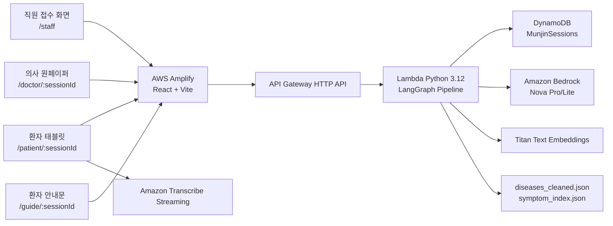

# 문진톡톡 (MunjinTalkTalk)

> 고령 환자가 말로 남긴 증상과 진료 질문을, 의료진이 바로 확인할 수 있는 진료 전 원페이퍼로 정리하는 음성 기반 AI 문진 MVP

문진톡톡은 지역 고령 환자의 구어체, 사투리, 복약 걱정, 진료 질문을 구조화하여 접수처, 환자 태블릿, 의사 원페이퍼, 환자 안내문까지 하나의 흐름으로 연결하는 서비스입니다.

이 저장소는 발표용 화면만 담은 목업이 아니라, AWS 서버리스 환경에서 실제로 동작하는 MVP 코드입니다. 프론트엔드는 AWS Amplify에서 배포하고, 백엔드는 API Gateway, Lambda, DynamoDB, Amazon Transcribe Streaming, Amazon Bedrock, Titan Embedding을 사용합니다.

문진톡톡은 진단, 처방, 질병 예측을 제공하지 않습니다. 환자 발화를 의료진이 확인하기 쉬운 형태로 정리하는 진료 보조 및 인수인계 도구입니다.

---

## 빠른 문서 지도

처음 보는 사람은 아래 순서대로 읽으면 됩니다.

| 읽을 문서 | 무엇을 알 수 있나 |
| --- | --- |
| 이 README | 서비스가 무엇이고, 전체 구조가 어떻게 생겼는지 |
| [프론트엔드 README](frontend/README.md) | 접수처, 환자 태블릿, 의사 원페이퍼, 안내문 화면 구조 |
| [백엔드 README](backend/README.md) | 백엔드 전체 책임, 데이터 흐름, 서버리스 구성 |
| [서버리스 백엔드 README](backend/serverless/README.md) | SAM 배포, Lambda API, Bedrock/Transcribe/IR 설정 |
| [문서 모음](docs/README.md) | 세부 문서 읽는 순서와 문서별 목적 |
| [프로젝트 구조](docs/PROJECT_STRUCTURE.md) | 파일별 역할과 어디를 수정해야 하는지 |
| [LangGraph 파이프라인](docs/LANGGRAPH_PIPELINE.md) | 환자 답변 1개가 처리되는 실제 노드 흐름 |
| [내부 JSON 스키마](docs/DATA_SCHEMA.md) | DynamoDB, LLM extraction, onepaper, guide JSON 구조 |
| [MVP 실행 가이드](docs/MVP_SETUP.md) | 로컬 실행, test 배포, 스모크 테스트 |
| [AWS 배포 가이드](docs/DEPLOYMENT.md) | Amplify, SAM, 환경 변수, 배포 확인 절차 |
| [기술 설명 HTML](docs/technical-guide.html) | 발표나 팀 공유용 시각적 설명 페이지 |

---

## 한 줄 요약

```text
접수처 세션 생성
  -> 환자 태블릿 음성 문진
  -> Amazon Transcribe Streaming으로 실시간 텍스트화
  -> Bedrock LLM이 의미 분할과 표준화
  -> Pydantic schema와 source_quote 검증
  -> BM25 + Titan Vector Hybrid IR로 표준 증상 매칭
  -> LangGraph trace가 남는 원페이퍼 생성
  -> 의사가 확인하고 환자 안내문 출력
```

---

## 왜 만들었나

고령 환자의 진료 과정에서는 “의사가 묻기 전에 환자가 정확히 말하지 못하는 정보”가 자주 발생합니다.

대표적인 문제는 다음과 같습니다.

| 문제 | 현장에서 생기는 일 | 문진톡톡의 해결 방향 |
| --- | --- | --- |
| 구어체와 사투리 | “코가 맥혀요”, “목이 칼칼해요” 같은 표현이 표준 증상명으로 바로 정리되지 않음 | LLM 표준화와 source_quote 보존으로 원문과 표준 표현을 함께 보여줌 |
| 진료실 질문 누락 | 복약, 건강식품, 재방문 기준 같은 질문을 진료실에서 잊고 넘어감 | Q4에서 환자 질문을 agenda로 분리하여 의사 답변 입력 영역에 연결 |
| 짧은 진료 시간 | 의료진이 증상, 경과, 복약, 질문을 모두 다시 확인해야 함 | 진료 전 원페이퍼에서 증상, 문맥, 확인 항목, EMR 초안을 한 화면에 제공 |
| 음성 기반 접근성 | 고령 환자가 긴 문진표를 직접 입력하기 어려움 | 태블릿에서 큰 버튼과 음성 입력 중심으로 문진 진행 |
| AI 결과 신뢰성 | LLM이 임의로 증상, 점수, 질문을 만들 위험 | Pydantic schema, enum, source_quote grounding, retry loop, final review로 제한 |

---

## 현재 MVP가 구현한 사용자 흐름

### 1. 직원 접수

접수처 직원이 환자의 기본 정보를 입력합니다.

- 이름
- 생년월일
- 성별
- 진료과
- 담당 의사
- 연락처
- 초진/재진 여부

세션을 생성하면 DynamoDB에 `session_id`가 만들어지고, 이 값이 환자 태블릿, 의사 원페이퍼, 환자 안내문 화면을 연결하는 공통 키가 됩니다.

### 2. 환자 태블릿 문진

환자는 태블릿 화면에서 초진/재진 질문을 순서대로 답합니다.

초진 예시:

| 질문 | 목적 |
| --- | --- |
| Q1. 어디가 불편하셔서 오셨어요? | 주호소와 주요 증상 추출 |
| Q2. 그 증상은 언제부터 그러셨어요? | 시작 시점과 경과 문맥 추출 |
| Q3. 지금 드시는 약이 있으세요? | 현재 복약, 영양제, 무복약 여부 확인 |
| Q4. 의사선생님께 묻고 싶은 점이 있으세요? | 환자 질문을 agenda로 분리 |

재진 예시:

| 질문 | 목적 |
| --- | --- |
| Q1. 지난번 진료 이후 어떻게 지내셨어요? | 이전 증상 변화 확인 |
| Q2. 처방받은 약은 잘 드시고 계세요? | 복약 순응도 확인 |
| Q3. 그동안 새로 생긴 증상은 없으세요? | 새 증상, 악화, 위험 표현 확인 |
| Q4. 지난번에 못 여쭤본 점이 있으신가요? | 재진 환자의 추가 질문 분리 |

음성은 S3에 저장하지 않습니다. 브라우저에서 Amazon Transcribe Streaming WebSocket으로 직접 전송하고, 최종적으로 인식된 텍스트만 백엔드의 `/process-answer`로 전달합니다.

### 3. 백엔드 문진 처리

환자 답변 1개는 LangGraph 파이프라인을 따라 처리됩니다.

1. 필수 입력 확인
2. 위험 표현 quick safety flag
3. Bedrock Nova 기반 의미 분할과 표준화
4. Pydantic fixed schema 검증
5. source_quote 원문 포함 여부 검증
6. 증상 문항이면 Hybrid IR 매칭
7. DynamoDB 세션 저장
8. 원페이퍼 갱신
9. 처리 trace 저장

자세한 노드 설명은 [LangGraph 파이프라인](docs/LANGGRAPH_PIPELINE.md)을 보면 됩니다.

### 4. 의사 원페이퍼

의사는 대기열에서 환자를 선택하고 원페이퍼를 확인합니다.

원페이퍼는 다음 영역으로 구성됩니다.

- 오늘 말한 불편함
- 원문 quote
- 표준 증상 매칭 결과
- 증상 문맥 chip
- 환자 질문과 의사 답변 입력
- 의료진 확인 항목
- EMR 복사용 문장
- 환자 안내 강조사항

증상 score는 LLM이 임의로 만든 점수가 아닙니다. BM25, Titan vector 유사도, 표준 증상명/별칭 직접 일치 신호를 조합한 IR 매칭 점수입니다.

### 5. 환자 안내문

의사가 환자 질문에 답변하고 강조사항을 입력하면 환자 안내문 화면에서 정리됩니다.

- 환자 질문별 쉬운 답변
- 의사 강조사항
- 말로 재생하기 버튼
- 종이 출력용 화면

의사가 직접 입력한 강조사항은 LLM이 바꾸지 않고 그대로 보여주는 것이 기본 원칙입니다.

---

## 현재 기술 구조



---

## LLM과 IR의 역할

문진톡톡은 LLM이 모든 것을 마음대로 결정하는 구조가 아닙니다.

| 단계 | 사용하는 기술 | 하는 일 | 저장 조건 |
| --- | --- | --- | --- |
| 음성 인식 | Amazon Transcribe Streaming | 환자 음성을 한국어 텍스트로 변환 | 음성 파일 저장 없음 |
| 의미 추출 | Bedrock Nova Pro/Lite | 환자 발화를 의미 단위로 분할하고 표준화 | Pydantic schema와 quote 검증 통과 필요 |
| prompt/message 조립 | LangChain Core | Bedrock에 보낼 메시지 구조 생성 | 프롬프트 계층 관리 |
| 파이프라인 제어 | LangGraph | 노드 순서, 분기, trace 관리 | active_path와 pipeline_trace 저장 |
| 증상 매칭 | BM25 + Titan Vector Hybrid IR | LLM이 추출한 증상 후보를 표준 증상명과 매칭 | IR threshold와 채택 이유 기록 |
| 원페이퍼 리뷰 | Bedrock Nova Pro | 의료진 확인 항목, EMR 초안, 누락/중복 점검 | review schema 검증 |
| 안내문 변환 | Bedrock Nova Lite | 의사 답변을 환자 안내문 형식으로 정리 | guide schema 검증 |

중요한 원칙:

- LLM은 `score`, `confidence`, `probability` 같은 임의 수치를 만들 수 없습니다.
- LLM이 만든 `source_quote`는 환자 원문에 실제로 존재해야 합니다.
- LLM 출력에 예상하지 않은 필드가 있으면 저장하지 않습니다.
- 증상 매칭은 LLM의 단독 판단이 아니라 원천 JSON 기반 IR로 수행합니다.
- rule-based fallback은 기본 운영 경로가 아니며, `ALLOW_RULE_FALLBACK=false`가 기본입니다.

---

## 저장소 구조

```text
munjin-talk-talk-mvp/
├── README.md
├── amplify.yml
├── frontend/
│   ├── README.md
│   ├── package.json
│   ├── src/
│   │   ├── App.jsx
│   │   ├── components/
│   │   ├── hooks/
│   │   ├── services/
│   │   ├── config/
│   │   └── styles/
│   └── .env.example
├── backend/
│   ├── README.md
│   └── serverless/
│       ├── README.md
│       ├── template.yaml
│       └── src/
│           ├── handler.py
│           ├── pipeline_graph.py
│           ├── pipeline_nodes.py
│           ├── extraction.py
│           ├── retrieval.py
│           ├── onepager.py
│           ├── guide.py
│           ├── schemas/
│           └── data/
└── docs/
    ├── PROJECT_STRUCTURE.md
    ├── LANGGRAPH_PIPELINE.md
    ├── DATA_SCHEMA.md
    ├── MVP_SETUP.md
    ├── DEPLOYMENT.md
    ├── architecture.drawio
    ├── architecture.svg
    └── technical-guide.html
```

더 자세한 파일별 설명은 [프로젝트 구조](docs/PROJECT_STRUCTURE.md)에 정리되어 있습니다.

---

## 로컬에서 빠르게 실행하기

프론트 화면만 확인할 때:

```powershell
cd C:\Users\CGB\munjin-talk-talk-mvp\frontend
npm install
Copy-Item .env.example .env.local
npm run dev -- --host 127.0.0.1 --port 5173
```

`frontend/.env.local`에서 `VITE_API_BASE_URL`이 비어 있고 `VITE_ENABLE_MOCKS=true`이면 UI 목업 모드로 실행됩니다.

실제 AWS 백엔드와 연결할 때:

```text
VITE_API_BASE_URL=https://<api-id>.execute-api.ap-northeast-2.amazonaws.com
VITE_ENABLE_MOCKS=false
```

브라우저에서 확인:

```text
http://127.0.0.1:5173/staff
```

자세한 순서는 [MVP 실행 가이드](docs/MVP_SETUP.md)를 참고하세요.

---

## AWS 배포 요약

### 백엔드

```powershell
cd C:\Users\CGB\munjin-talk-talk-mvp\backend\serverless
sam build
sam deploy --guided
```

배포 후 CloudFormation output의 `ApiEndpoint`를 프론트 환경 변수 `VITE_API_BASE_URL`에 넣습니다.

### 프론트엔드

Amplify에서 GitHub 저장소를 연결할 때:

```text
Repository: CHOIGIBUM/munjin-talk-talk-mvp 또는 팀 저장소
Branch: test 또는 main
Monorepo app root: frontend
Build command: npm run build
Build output directory: dist
Environment variable: VITE_API_BASE_URL=<API Gateway endpoint>
```

SPA rewrite 규칙:

```json
[
  {
    "source": "/<*>",
    "status": "404-200",
    "target": "/index.html"
  }
]
```

자세한 배포 절차는 [AWS 배포 가이드](docs/DEPLOYMENT.md)를 참고하세요.

---

## 운영과 개인정보 원칙

현재 MVP는 기능 검증용입니다. 실제 환자 데이터로 공개 테스트하기 전에는 아래 항목이 필요합니다.

- 직원/의사 화면 인증과 권한 분리
- DynamoDB 세션 보존 기간 정책
- CloudWatch 로그 보존 기간 정책
- Transcribe Streaming 외 음성 저장 경로 제거 확인
- 환자 동의 문구와 개인정보 처리 기준
- HTTPS 배포 확인
- Bedrock/Transcribe 비용 모니터링
- 실제 병원 업무 프로세스에 맞는 접수/대기 상태 정의

---

## 현재 test 브랜치의 핵심 구현 상태

| 영역 | 상태 |
| --- | --- |
| 접수처 세션 생성 | 구현됨 |
| 환자 태블릿 음성 문진 | 구현됨 |
| Transcribe Streaming | 구현됨, 음성 S3 저장 없음 |
| 환자 발화 확인 화면 | 구현됨 |
| quick safety flag | 구현됨 |
| Bedrock LLM extraction | 구현됨 |
| Pydantic fixed schema 검증 | 구현됨 |
| source_quote grounding | 구현됨 |
| bounded retry loop | 구현됨 |
| LangChain prompt/message 계층 | 구현됨 |
| LangGraph 파이프라인 | 구현됨 |
| BM25 + Titan Vector Hybrid IR | 구현됨 |
| 원페이퍼 | 구현됨 |
| 의사 답변과 안내문 출력 | 구현됨 |
| 인증/권한 | 아직 MVP 범위 밖 |
| 실제 EMR 연동 | 아직 MVP 범위 밖 |
| 방언 RAG | 계획 단계 |

---

## 팀

| 역할 | 이름 |
| --- | --- |
| 리더 | 최기범 |
| 팀원 | 김원재, 방정호, 서지민, 박나현 |

---

## 면책 조항

문진톡톡은 의료적 진단, 처방, 질병 예측을 수행하지 않습니다. 본 프로젝트는 환자 발화를 구조화하여 의료진의 확인을 돕는 MVP이며, 모든 진료 판단은 의료진이 수행해야 합니다.
