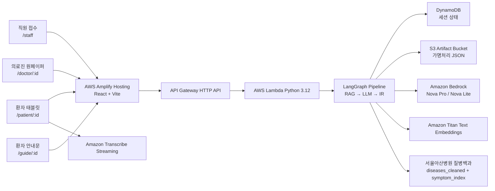
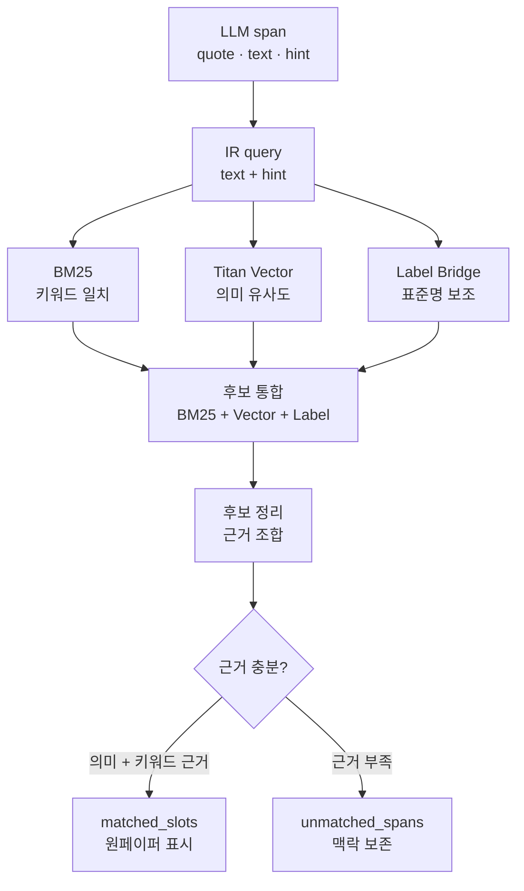

<div align="center">

<h1>
  
  문진톡톡 · MunjinTalkTalk
</h1>

어르신의 말은 쉽게, 의료진의 확인은 빠르게.

고령 환자가 말로 답한 문진을 구조화, 표준 증상 매칭, 검증을 거쳐 진료 전엔 *의료진용 원페이퍼*로, 진료 후엔 *환자용 안내문*으로 바꿔주는 AI 문진 보조 MVP


<br/>

<a href="https://main.dv5herezqtt1t.amplifyapp.com">
  
</a>

<sub>직원/의사 접근 코드는 최종 제출 자료에 별도로 기재합니다.</sub>

</div>

> ⚠️ 문진톡톡은 진단·처방·질병 예측을 하지 않습니다.
>
> 환자 발화를 의료진이 확인하기 쉬운 형태로 정리하는 *진료 보조 도구*이며, 모든 의료 판단은 의료진이 수행합니다.

---

## 🩺 우리가 푸는 문제

진료실에서 고령 환자와 의료진 사이에서는 매일 같은 병목이 반복됩니다.

환자는 증상을 조리 있게 말하기 어렵습니다. 진료실에 들어가면 긴장하고, 사투리·비표준 표현을 쓰거나, 정작 중요한 내용을 빠뜨리기 쉽습니다. 의료진은 짧은 외래 진료 흐름 안에서 주호소, 발병 시점, 복약 내용, 환자 질문을 매번 처음부터 다시 확인해야 합니다.

그 결과 핵심 정보가 누락되고, 진료 시간 상당 부분이 정보 수집에 소모되며, 환자는 정작 묻고 싶었던 질문을 하지 못한 채 진료실을 나옵니다.

이 문제는 단순한 불편이 아니라 고령화, 높은 외래 진료량, 건강정보 이해 격차, 디지털 문진 장벽이 겹친 구조적 문제입니다.

- 통계청·국가데이터처의 2025년 고령자 통계에 따르면 우리나라 65세 이상 인구 비중은 20.3%이며, 강원 지역은 25.7%로 전국 평균보다 높습니다.

([국가데이터처 2025 고령자 통계](https://mods.go.kr/board.es?act=view&bid=10820&list_no=438832&mid=a10301010000&ref_bid=&tag=))

- 국회입법조사처는 우리나라 국민의 외래 진료 횟수가 1인당 연간 16.6회로 OECD 국가 중 가장 많으며, 짧은 시간에 많은 환자를 진찰해야 하는 구조를 지적합니다.

([국회입법조사처 의료서비스 이용 현황](https://www.nars.go.kr/fileDownload2.do?doc_id=1N19WkRJPsG&fileName=%28%EC%A7%80%ED%91%9C%EB%A1%9C+%EB%B3%B4%EB%8A%94+%EC%9D%B4%EC%8A%88+150%ED%98%B8-20200221%29%EC%9A%B0%EB%A6%AC%EB%82%98%EB%9D%BC+%EA%B5%AD%EB%AF%BC%EC%9D%98+%EC%9D%98%EB%A3%8C%EC%84%9C%EB%B9%84%EC%8A%A4+%EC%9D%B4%EC%9A%A9+%ED%98%84%ED%99%A9%EA%B3%BC+%EC%8B%9C%EC%82%AC%EC%A0%90.pdf))

- 건강정보이해능력이 낮은 고령자·취약계층은 질병 치료 방법을 찾고, 추가 진료 필요 여부를 판단하고, 복약 지시를 이해·이행하는 과정에서 어려움을 겪을 수 있습니다.

 ([건강정보이해력 연구](https://www.kci.go.kr/kciportal/ci/sereArticleSearch/ciSereArtiView.kci?sereArticleSearchBean.artiId=ART003247633))

- 2024년 디지털정보격차 실태조사에서 취약계층의 디지털 정보화 수준은 일반 국민 대비 77.5%, 고령층은 71.4%로 나타납니다. 단말기 접근성은 높아졌지만, 앱·웹 기반 서비스를 스스로 찾아 설치하고 활용하는 역량은 여전히 낮습니다.

([KOSIS 디지털정보화 수준](https://kosis.kr/statHtml/statHtml.do?orgId=127&tblId=DT_12017N008))

- 분당서울대병원 연구팀이 65세 이상 505명을 조사한 결과, 87.1%가 앱을 사용한다고 답했지만 63.2%는 앱 설치·삭제를 스스로 하지 못한다고 응답했습니다. 즉 의료 서비스가 "앱을 설치하고, 로그인해서, 스스로 문항을 입력하는 방식"에 머물면, 실제로 의료가 더 필요한 고령 환자가 첫 단계에서부터 소외될 위험이 큽니다.

([고령층 앱 활용 실태 보도](https://www.kukinews.com/article/view/kuk202401170004))

기존 앱·온라인 기반 사전 문진은 새 앱 설치, 로그인, 작은 화면의 문항 읽기, 직접 입력을 전제로 하기 때문에 고령층에게 진입 장벽이 높습니다. 반대로 단순 LLM 챗봇은 *환각·임의 진단* 가능성 때문에 의료 영역에서 단독 사용이 어렵습니다.

문진톡톡은 "앱을 잘 쓰는 환자"가 아니라 "말로 설명하는 환자"를 전제로 설계합니다. 환자는 현장에서 말로 답하고, AI는 정리만 하며, 최종 판단은 의료진이 하는 원칙으로 이 병목을 풉니다.

---

## ✨ 어떻게 동작하나

접수처 직원이 세션을 만들면, 환자는 태블릿에서 음성으로 문진에 답합니다. 백엔드는 환자의 발화를 구조화하고 표준 증상과 매칭·검증한 뒤, 의료진이 빠르게 확인할 수 있는 원페이퍼를 만듭니다. 진료 후 의사가 답변과 강조사항을 남기면, 환자가 읽을 안내문이 생성됩니다.

```text
[직원 접수] → [환자 동의] → [Q1~Q4 음성 문진] → [실시간 텍스트 전사]
                                      │
                                      ▼
                       [확정 텍스트 일괄 저장 /process-answers]
                                      │
               ┌──────────────────────┴──────────────────────┐
               ▼                                             ▼
 [환자 완료 화면 · 태블릿 대기열 복귀]              [백그라운드 Lambda 분석]
                                                             │
                                                             ▼
              [RAG 참고 컨텍스트] → [LLM 구조화] → [스키마/원문 검증]
                                                             │
                                                             ▼
                         [Hybrid IR 표준 증상 매칭] → [의료진 원페이퍼]
                                                             │
                                                             ▼
                                             [의사 답변 입력] → [환자 안내문 출력]
```

### 화면 구성

| 화면 | 경로 | 역할 |
|:---:|:---:|:---|
| 직원 접수 | `/staff` | 환자 정보 입력<br>초진/재진 선택<br>문진 세션 생성 |
| 환자 태블릿 | `/patient/:sessionId` | 음성 문진<br>STT 결과 확인<br>동의 모달·직원 도움 요청 |
| 의료진 원페이퍼 | `/doctor/:sessionId` | 증상·환자 원문 확인<br>문진 맥락·확인 항목 확인<br>EMR 초안 확인 |
| 환자 안내문 | `/guide/:sessionId` | 의사 답변을 어르신 표현으로 정리<br>종이 출력 |

## 🛡️ 의료 안전을 위한 LLM 통제 구조

문진톡톡은 LLM의 답을 그대로 의료진 화면에 올리지 않습니다. 환자 발화를 정리하는 데 LLM을 쓰되, 원문 대조·스키마 검증·표준 증상 검색·의료진 확인을 거쳐야만 원페이퍼에 반영합니다.

| 위험 지점 | 문진톡톡의 처리 방식 | 의료진 화면에서 보이는 결과 |
| --- | --- | --- |
| LLM이 숫자 점수나 확률을 만들어 진단처럼 보일 수 있음 | `score`, `confidence`, `probability` 같은 임의 수치를 사용하지 않음 | 숫자 대신 `매칭됨`, `우선 확인`처럼 확인 상태만 표시 |
| LLM이 환자가 말하지 않은 내용을 만들 수 있음 | `source_quote`가 실제 환자 원문 안에 있는지 검사 | 증상 옆에 환자 원문 quote를 함께 표시 |
| LLM JSON 형식이 흔들릴 수 있음 | Pydantic 스키마로 필수 필드, enum, 타입, 추가 필드 여부를 검증 | 실패 시 정상 결과처럼 숨기지 않고 재분석 또는 수동 확인으로 전환 |
| LLM이 임의 증상명을 확정할 수 있음 | LLM 증상 후보를 Hybrid IR(BM25 + Titan Vector + label bridge)로 표준 증상명에 연결 | 원천 데이터에 있는 표준 증상명만 `matched_slots`에 반영 |
| 객혈, 흉통 같은 위험 표현이 묻힐 수 있음 | rule-based safety flag를 LLM 분석과 별도로 실행 | 원페이퍼 상단에 우선 확인 경고 표시 |

이러한 구조는 LLM을 “의료 판단자”가 아니라 “문진 정리 보조자”로 제한하여 활용합니다. <br>최종 판단과 처치는 항상 의료진이 수행합니다.

---

## 🏗️ 기술 아키텍처

아래 그래프는 화면, API, 서버리스 백엔드, AWS AI 서비스, 저장소의 연결 관계를 보여주는 상위 구조입니다. LangChain과 LangGraph는 별도 외부 서비스가 아니라, Lambda 내부에서 문진 분석 순서를 구현하기 위해 사용한 코드 레벨의 파이프라인 구성입니다.



### 기술 스택

| 영역 | 기술 | 도입 목적 |
| --- | --- | --- |
| Frontend | React 18, Vite, React Router | 접수·태블릿·원페이퍼·안내문을 하나의 경량 SPA로 구성 |
| Hosting | AWS Amplify | 배포 URL 제공, HTTPS, 프론트 빌드 자동화, WAF 연계 |
| API / Compute | API Gateway HTTP API, AWS Lambda (Python 3.12) | 문진 세션과 LLM 파이프라인을 서버리스로 실행 |
| 음성 인식 | Amazon Transcribe Streaming | 음성 원본을 저장하지 않고 확정 텍스트만 처리 |
| LLM | Amazon Bedrock — Nova Pro(강), Nova Lite(경) | 복잡한 구조화·검토와 가벼운 표준화 작업을 분리 |
| 임베딩 | Amazon Titan Text Embeddings v2 | 환자 표현과 표준 증상 문서의 의미 유사도 계산 |
| 파이프라인 | LangGraph `StateGraph` + LangChain Core Runnable/Parser | Lambda 내부 처리 순서, retry, 검증 실패 분기, trace 가능한 흐름 구성 |
| 검증 | Pydantic v2 스키마 검증 | LLM JSON의 필수 필드, enum, 원문 quote, extra field를 엄격히 확인 |
| 검색 | BM25 + Titan Vector Hybrid IR | 키워드 일치와 의미 유사도를 함께 사용해 표준 증상 후보 검색 |
| 저장 | DynamoDB(상태·포인터) + S3(가명처리 산출물) | 운영 상태와 상세 산출물을 분리해 저장 최소화 |
| 인프라 정의 | AWS SAM (`template.yaml`) | API Gateway, Lambda, 환경변수, 권한을 코드로 관리 |

### Lambda 내부 파이프라인 구현

위 그래프의 `Lambda 내부 문진 처리`는 아래 코드로 구현됩니다. LangGraph는 처리 노드의 순서와 재시도 분기를 정의하고, LangChain은 Bedrock 프롬프트 호출과 JSON 파싱을 일관된 체인으로 묶는 역할을 합니다.

| 코드 | 하는 일 |
| --- | --- |
| `src/pipeline_graph.py` | 문진 분석 노드 순서와 retry/safety/stop 조건부 분기 정의 |
| `src/pipeline_nodes.py` | RAG 참고 컨텍스트, LLM 구조화, Pydantic/원문 검증, Hybrid IR, S3 저장을 노드 함수로 분리 |
| `src/langchain_prompting.py` | `ChatPromptTemplate → Bedrock converse → JsonOutputParser` 체인 구성 |
| [docs/LANGGRAPH_PIPELINE.md](docs/LANGGRAPH_PIPELINE.md) | 답변이 실제로 거치는 파이프라인 흐름 상세 |

---

## 🔍 Hybrid IR — 표준 증상 매칭

LLM이 정리한 증상 표현을 그대로 진단처럼 쓰지 않고, 서울아산병원 질병백과 기반 증상 데이터의 표준 증상명에 다시 맞춥니다. 이 단계의 목적은 “환자가 한 말”을 “원천 데이터에 존재하는 증상 슬롯”으로 연결하는 것입니다.

IR은 내부 배포 환경의 비공개 런타임 데이터(`diseases_cleaned.json`, `symptom_index.json`, Titan embedding cache)를 사용합니다. 이 데이터는 서울아산병원 질병백과 기반 원천 데이터와 그 파생 인덱스라 공개 Git 저장소에는 포함하지 않습니다. 공개 저장소에는 데이터 구조와 배치 기준만 남기고, 실제 배포 시에는 팀 내부 비공개 경로에서 Lambda 패키지에 주입합니다.

1. LLM extraction이 `source_quote`, `normalized_text`, `name`을 가진 증상 span을 생성
2. IR query는 `normalized_text + name`을 중심으로 구성하고, 원문 quote는 화면 근거와 검증용으로 보존
3. BM25가 표준 증상 문서와의 키워드 일치를 계산
4. Titan embedding이 환자 표현과 표준 증상 문서의 의미 유사도를 계산
5. 표준 증상명과 직접 가까운 표현은 label bridge로 보조 반영
6. BM25 상위 후보, Titan vector 상위 후보, label 후보를 합친 뒤 근거가 겹치는 후보를 우선 정리
7. Titan 의미 신호, BM25 키워드 신호, label 근거가 함께 잡히는 후보를 우선 확정하고, 근거가 부족한 후보는 문진 맥락으로 보존
8. 운영 산출물에는 임의 점수·전체 후보 목록·prompt 전문을 저장하지 않고, 원페이퍼에는 “매칭됨/우선 확인”처럼 의료진이 해석 가능한 상태만 표시

### Hybrid IR 처리 흐름



쉽게 말하면, 환자 말을 바로 증상명으로 믿지 않고 “서울아산병원 질병백과 기반 표준 증상 목록”에서 근거가 충분한 항목만 다시 고르는 단계입니다.

| 그래프 항목 | 쉬운 설명 | 예시 |
| --- | --- | --- |
| `LLM span` | 환자 발화에서 증상처럼 보이는 조각을 뽑고, 원문과 표준화 표현을 함께 남깁니다. | 원문 `"목도 아프고"` → 표준화 `"목이 아픔"` → 힌트 `"목 통증"` |
| `IR query` | 검색에 사용할 짧은 문장을 만듭니다. | `목이 아픔 목 통증` |
| `BM25` | 같은 단어가 많이 겹치는 표준 증상 문서를 찾습니다. | `목`, `통증` 단어가 있는 증상 후보가 올라옴 |
| `Titan Vector` | 단어가 조금 달라도 뜻이 가까운 표준 증상 문서를 찾습니다. | `"목이 칼칼함"`이 `인후통`, `목의 통증`과 가까운지 비교 |
| `Label Bridge` | 표준 증상명과 거의 같은 표현은 놓치지 않도록 보조합니다. | 환자 표현에 `두통`이 있으면 `두통` 후보를 보존 |
| `후보 정리` | 키워드, 의미, 표준명 근거를 함께 보고 후보를 추립니다. | BM25와 Titan이 모두 지지하는 후보를 우선 확인 |
| `근거 충분?` | 근거가 충분하면 원페이퍼에 증상으로 표시하고, 부족하면 문진 맥락에만 남깁니다. | 확실하면 `매칭됨`, 애매하면 의료진이 원문으로 확인 |

### 예시

| 단계 | 예시 |
| --- | --- |
| 환자 원문 | `"어제부터 목도 아프고 콧물도 조금 나와요"` |
| 표준화 | `"어제부터 목도 아프고 콧물도 조금 나와요"` |
| LLM span | `source_quote="목도 아프고"`, `normalized_text="목이 아픔"`, `status="new"`, `symptom_hint="목 통증"` |
| IR query | `목이 아픔 목 통증` |
| 표준 증상 매칭 | 서울아산병원 질병백과 기반 `symptom_index`와 `diseases_cleaned`에서 생성한 후보 중 `목의 통증` slot 확정 |
| 원페이퍼 표시 | 증상명, 환자 원문 quote, 문진 맥락을 함께 표시하고 의료진이 확인 |

이 흐름에서 LLM의 역할은 “환자 말을 의미 단위로 정리하는 것”이고, 실제 표준 증상명은 원천 데이터 기반 IR과 validator를 통과해야만 남습니다.

---

## 🔐 저장 최소화 원칙

문진톡톡은 환자 식별 정보와 음성 원본을 오래 보관하지 않는 방향으로 설계했습니다. 서비스 실행에 꼭 필요한 상태값은 DynamoDB에 작게 남기고, 의료진 확인에 필요한 상세 산출물은 가명처리된 JSON만 S3에 분리 저장합니다. AWS 콘솔에서 적용한 WAF, CloudTrail, Macie 같은 운영 보안 설정은 아래 `운영 보안 수준`에 따로 정리했습니다.

| 저장소 | 저장하는 값 | 저장하지 않는 값 |
| --- | --- | --- |
| DynamoDB | `session_id`, 대기 순번, 상태, 마스킹 환자명, 연령대, 성별, 진료과, S3 artifact key | 실명, 생년월일, 연락처, 문항 원문, 원페이퍼/안내문 전체 |
| S3 | 가명처리 산출물 (`*.redacted.json`) + 최소 설명 trace | 음성 원본, prompt 전문, LLM raw response, 전체 후보 목록 |

- 음성 원본 파일은 저장하지 않습니다. 브라우저가 Transcribe Streaming으로 직접 전송하고, 확정 텍스트만 파이프라인으로 넘어갑니다.
- 접수 시 실명은 마스킹 표시명으로, 생년월일은 연령대로 변환하고 연락처 원문은 저장하지 않습니다.
- 상세 기준: [docs/SECURITY_DATA_INVENTORY.md](docs/SECURITY_DATA_INVENTORY.md)

---

## 🚀 빠른 시작

### 1. 데모 확인

배포된 서비스는 상단의 [데모 URL](https://main.dv5herezqtt1t.amplifyapp.com)에서 확인합니다. 심사용 직원/의사 접근 코드는 최종 제출 자료와 발표자료에 별도로 기재합니다.

### 2. 프론트엔드 로컬 실행

```bash
cd frontend
npm install
cp .env.example .env.local
npm run dev -- --host 127.0.0.1 --port 5173
# 브라우저: http://127.0.0.1:5173/staff
```

<details>
<summary>Windows PowerShell</summary>

```powershell
cd frontend
npm install
Copy-Item .env.example .env.local
npm run dev -- --host 127.0.0.1 --port 5173
# 실행 정책으로 npm이 막히면 npm.cmd 사용
```
</details>

AWS 백엔드 연결 시 `frontend/.env.local`:

```text
VITE_API_BASE_URL=https://<api-id>.execute-api.<region>.amazonaws.com
```

### 3. 백엔드 배포

```bash
cd backend/serverless
sam build
sam deploy --guided   # ArtifactsBucketName 에 가명처리 산출물용 S3 버킷명 입력
```

### 4. 배포 시 필요한 비공개 데이터

프론트엔드, Lambda 코드, SAM 템플릿, 스키마, 평가 스크립트는 공개 저장소에 포함되어 있습니다. 실제 배포 환경에서는 저작권과 보안 처리가 필요한 서울아산병원 질병백과 기반 IR 런타임 데이터(`diseases_cleaned.json`, `symptom_index.json`, embedding cache`)만 팀 내부 비공개 경로에서 Lambda 패키지에 배치합니다.

## 🗂️ 저장소 구조

```text
munjin-talk-talk/
├── frontend/              # React + Vite SPA (4개 화면)
│   └── src/               # 화면 컴포넌트, API client, STT hook, 스타일
├── backend/serverless/
│   ├── template.yaml      # SAM: API Gateway + Lambda
│   └── src/
│       ├── pipeline_graph.py     # LangGraph 조립
│       ├── pipeline_nodes.py     # 처리 노드
│       ├── langchain_prompting.py# Bedrock JSON chain
│       ├── retrieval*.py         # Hybrid IR
│       ├── schemas/              # Pydantic 스키마
│       └── data/                 # 공개 도메인팩 · 질문셋 / 비공개 IR 데이터 배치 위치
├── evaluation/            # IR 성능 평가 스크립트와 평가 입력 형식
└── docs/                  # 아키텍처 · 파이프라인 · 데이터 · 보안 문서
```

### 더 깊이 읽기

| 문서 | 내용 |
| --- | --- |
| [frontend/README.md](frontend/README.md) | 화면·라우팅·STT·API 연동 |
| [backend/README.md](backend/README.md) | 백엔드 책임·LangGraph·LLM·IR·저장 |
| [backend/serverless/README.md](backend/serverless/README.md) | SAM 배포·endpoint·환경변수 |
| [docs/LANGGRAPH_PIPELINE.md](docs/LANGGRAPH_PIPELINE.md) | 답변 1개가 거치는 노드 흐름 |
| [docs/DATA_SCHEMA.md](docs/DATA_SCHEMA.md) | DynamoDB·S3·extraction·onepaper·guide JSON |
| [docs/SECURITY_DATA_INVENTORY.md](docs/SECURITY_DATA_INVENTORY.md) | 필드별 보안 처리 기준 |

---

## 🛡️ 운영 보안 수준

이 섹션은 코드 설정과 AWS 콘솔에서 적용한 운영 보안 설정을 함께 정리합니다. 문진톡톡은 의료 문진 텍스트가 오가는 서비스를 전제로, 음성 원본 미저장·가명처리·저장 최소화·접근 제어를 기본 원칙으로 설계했습니다.

| 구분 | 적용 내용 |
| --- | --- |
| 접근 제어 | 직원/의사 접근 코드 로그인, 만료 세션 토큰, 환자 세션 토큰 |
| 음성 처리 | 음성 원본 미저장 Transcribe Streaming |
| 저장 최소화 | DynamoDB에는 상태와 S3 artifact key만 저장, S3에는 가명처리 artifact 저장 |
| 보관 기간 | DynamoDB TTL, S3 Lifecycle 3일 삭제, CloudWatch Logs 보존 기간 제한 설정 |
| 경계 보안 | CORS origin 제한, API Gateway throttling, Amplify WAF |
| 감사·탐지 | CloudTrail, GuardDuty, Security Hub, Macie |
| AI 서비스 정책 | AWS AI Services opt-out 정책 적용 |

---

## 👥 팀

| 역할 | 이름 |
| --- | --- |
| 리더 | 최기범 |
| 팀원 | 김원재, 방정호, 서지민, 박나현 |

---

## ⚖️ 면책 및 라이선스

문진톡톡은 의료적 진단·처방·질병 예측을 수행하지 않습니다. 환자 발화를 구조화해 의료진 확인을 돕는 MVP이며, 모든 진료 판단은 의료진이 수행해야 합니다.

코드는 해커톤 제출 및 심사용 공개를 목적으로 정리되어 있습니다. 원천 의료 백과 데이터와 그 파생 인덱스·embedding cache는 공개 저장소에 포함하지 않습니다.
