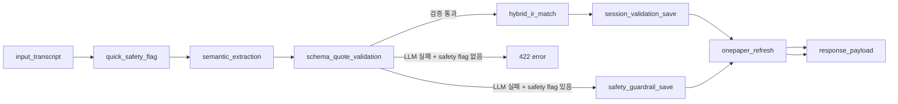

# 문진톡톡 Serverless Backend

이 폴더는 문진톡톡 MVP의 AWS 서버리스 백엔드입니다.

AWS SAM으로 API Gateway HTTP API와 Python 3.12 Lambda를 배포합니다. 세션 데이터는 DynamoDB에 저장하고, 음성 인식은 Amazon Transcribe Streaming을 사용하며, 의미 추출과 원페이퍼 리뷰는 Amazon Bedrock을 사용합니다.

---

## 한눈에 보는 구성

```text
React/Vite frontend
  -> API Gateway HTTP API
  -> Lambda Python 3.12
  -> DynamoDB MunjinSessions
  -> Amazon Transcribe Streaming
  -> Amazon Bedrock Nova Pro/Lite
  -> Amazon Titan Text Embeddings
```

중요한 원칙:

- 환자 음성 파일은 S3에 저장하지 않습니다.
- 프론트는 Transcribe Streaming WebSocket으로 음성을 직접 전송합니다.
- 백엔드는 인식된 텍스트만 받아 LLM/IR/원페이퍼 처리를 수행합니다.
- LLM JSON은 Pydantic schema와 원문 quote 검증을 통과해야 저장됩니다.

---

## 폴더 구조

```text
backend/serverless/
├── README.md
├── template.yaml
├── samconfig.toml
├── s3-cors.json
└── src/
    ├── handler.py
    ├── common.py
    ├── settings.py
    ├── sessions.py
    ├── audio.py
    ├── llm.py
    ├── langchain_prompting.py
    ├── orchestration.py
    ├── pipeline_graph.py
    ├── pipeline_nodes.py
    ├── pipeline_state.py
    ├── pipeline_trace.py
    ├── extraction.py
    ├── extraction_prompts.py
    ├── extraction_schema.py
    ├── extraction_fallback.py
    ├── retrieval.py
    ├── retrieval_documents.py
    ├── retrieval_embeddings.py
    ├── retrieval_scoring.py
    ├── clinical_terms.py
    ├── onepager.py
    ├── onepager_sections.py
    ├── onepager_review.py
    ├── guide.py
    ├── schemas/
    └── data/
```

---

## API endpoint

| Method | Path | 역할 |
| --- | --- | --- |
| `POST` | `/sessions` | 접수처에서 문진 세션 생성 |
| `GET` | `/sessions/{session_id}` | 특정 세션 상세 조회 |
| `POST` | `/sessions/{session_id}/staff-help` | 환자 태블릿에서 직원 도움 요청 |
| `POST` | `/transcribe-stream-url` | Transcribe Streaming WebSocket URL 발급 |
| `POST` | `/process-answer` | 환자 답변 1개를 LangGraph 파이프라인으로 처리 |
| `POST` | `/extract` | LLM extraction 단독 테스트 |
| `POST` | `/match` | Hybrid IR 단독 테스트 |
| `POST` | `/validate` | 저장/원페이퍼 갱신 단독 테스트 |
| `GET` | `/doctor/queue` | 의사 대기열과 접수 목록 조회 |
| `GET` | `/onepager/{session_id}` | 원페이퍼 조회 및 갱신 |
| `POST` | `/doctor-response` | 의사 답변과 환자 강조사항 저장 |
| `GET` | `/guide/{session_id}` | 환자 안내문 조회 |

과거 배치형 STT endpoint:

| Method | Path | 현재 상태 |
| --- | --- | --- |
| `POST` | `/upload-url` | 환자 음성 저장 금지 원칙으로 사용하지 않음 |
| `GET` | `/transcribe-result` | 과거 호환용. 실제 환자 음성 경로에서는 사용하지 않음 |

---

## 주요 모듈 설명

### API와 설정

| 파일 | 설명 |
| --- | --- |
| `handler.py` | Lambda entrypoint. API Gateway method/path를 각 업무 함수로 라우팅 |
| `common.py` | 예전 import 호환용 facade. 핵심 로직은 각 전용 모듈에 있음 |
| `settings.py` | 환경 변수, 모델 ID, AWS client, 데이터 파일 경로 |
| `sessions.py` | DynamoDB session 저장, 조회, queue number, public response 변환 |

### 음성 인식

| 파일 | 설명 |
| --- | --- |
| `audio.py` | Amazon Transcribe Streaming presigned WebSocket URL 생성 |

환자 음성은 백엔드로 파일 업로드되지 않습니다. 프론트가 WebSocket URL을 받아 직접 Amazon Transcribe Streaming과 통신합니다.

### LLM과 LangChain

| 파일 | 설명 |
| --- | --- |
| `llm.py` | Bedrock Runtime JSON 호출 공통 함수 |
| `langchain_prompting.py` | LangChain Core로 Bedrock messages 구성 |
| `extraction_prompts.py` | 문항별 extraction prompt와 모델 라우팅 |
| `onepager_review.py` | 의료진 확인 항목, EMR 초안, 원페이퍼 리뷰 |
| `guide.py` | 환자 안내문 생성과 TTS용 문장 정리 |

### LangGraph 파이프라인

| 파일 | 설명 |
| --- | --- |
| `orchestration.py` | `/process-answer`의 얇은 진입점 |
| `pipeline_graph.py` | LangGraph 노드 연결과 조건 분기 |
| `pipeline_nodes.py` | 실제 노드 처리 함수 |
| `pipeline_state.py` | 파이프라인 상태 타입과 그래프 메타데이터 |
| `pipeline_trace.py` | trace, active_path, orchestration snapshot 저장 |

### Schema validation

| 파일 | 설명 |
| --- | --- |
| `schemas/extraction.py` | LLM extraction fixed schema |
| `schemas/review.py` | 원페이퍼 review LLM fixed schema |
| `schemas/guide.py` | 환자 안내문 LLM fixed schema |
| `extraction_schema.py` | runtime 기본값 보강, quote grounding, 문항 단위 검증 |

### Hybrid IR

| 파일 | 설명 |
| --- | --- |
| `clinical_terms.py` | 표준 증상과 안전 키워드 로딩 |
| `retrieval.py` | 증상 후보 검색과 채택 판정 |
| `retrieval_documents.py` | 원천 JSON을 검색 문서로 deterministic 변환 |
| `retrieval_embeddings.py` | Titan embedding 호출과 cache |
| `retrieval_scoring.py` | BM25, cosine, label score 계산 |
| `data/diseases_cleaned.json` | 질환/증상 원천 정제 데이터 |
| `data/symptom_index.json` | 표준 증상 인덱스 |
| `data/symptom_embeddings_*.json` | Titan embedding 사전 계산 cache |

---

## LangGraph 노드 순서



자세한 설명은 [LangGraph 파이프라인 문서](../../docs/LANGGRAPH_PIPELINE.md)를 참고하세요.

---

## AWS 리소스 준비

### 1. DynamoDB

테이블:

```text
MunjinSessions
```

필수 partition key:

```text
session_id (String)
```

권장:

- 온디맨드 billing
- 테스트 후 항목 삭제 또는 TTL 정책 검토
- 실제 환자 데이터 투입 전 retention 정책 확정

### 2. IAM Role

Lambda execution role이 필요합니다.

필요 권한:

- CloudWatch Logs 작성
- DynamoDB `GetItem`, `PutItem`, `UpdateItem`, `Scan`
- Bedrock `InvokeModel`
- Transcribe Streaming `StartStreamTranscriptionWebSocket`
- SAM artifact bucket 접근

실제 운영 전에는 resource ARN을 좁히는 것이 좋습니다.

### 3. S3 bucket

`ArtifactsBucketName`은 현재 환자 음성 저장소가 아닙니다.

용도:

- SAM/CloudFormation artifact
- 임시 배포 산출물

환자 음성은 이 bucket에 업로드하지 않습니다.

### 4. Bedrock model access

`ap-northeast-2`에서 아래 모델 사용 권한을 확인합니다.

```text
apac.amazon.nova-pro-v1:0
apac.amazon.nova-lite-v1:0
amazon.titan-embed-text-v2:0
```

---

## SAM 배포

```powershell
cd C:\Users\CGB\munjin-talk-talk-mvp\backend\serverless
sam build
sam deploy --guided
```

입력 예시:

```text
Stack Name: munjin-mvp-backend-test
AWS Region: ap-northeast-2
Parameter SessionsTableName: MunjinSessionsTest
Parameter ArtifactsBucketName: <artifact-bucket-name>
Parameter LambdaRoleArn: arn:aws:iam::<account-id>:role/<lambda-role-name>
Parameter CustomVocabularyName:
Confirm changes before deploy: y
Allow SAM CLI IAM role creation: n
MunjinApiFunction has no authentication. Is this okay?: y
```

배포가 끝나면 output을 확인합니다.

```text
ApiEndpoint: https://<api-id>.execute-api.ap-northeast-2.amazonaws.com
```

이 값을 프론트 환경 변수에 넣습니다.

```text
VITE_API_BASE_URL=https://<api-id>.execute-api.ap-northeast-2.amazonaws.com
```

---

## test 브랜치 배포 예시

현재 test 백엔드에 배포할 때 사용했던 형태:

```powershell
cd C:\Users\CGB\munjin-talk-talk-mvp\backend\serverless

$env:SAM_CLI_TELEMETRY='0'
$env:APPDATA='C:\Users\CGB\AppData\Local\Temp'
$env:Path='C:\Users\CGB\AppData\Local\Programs\Python\Python312;C:\Users\CGB\AppData\Local\Programs\Python\Python312\Scripts;' + $env:Path

& 'C:\Program Files\Amazon\AWSSAMCLI\bin\sam.cmd' build

& 'C:\Program Files\Amazon\AWSSAMCLI\bin\sam.cmd' deploy `
  --stack-name munjin-mvp-backend-test `
  --region ap-northeast-2 `
  --resolve-s3 `
  --capabilities CAPABILITY_IAM `
  --no-confirm-changeset `
  --no-fail-on-empty-changeset `
  --parameter-overrides "SessionsTableName=MunjinSessionsTest ArtifactsBucketName=<bucket-name> LambdaRoleArn=<lambda-role-arn> CustomVocabularyName=unused"
```

계정, bucket, role 값은 각 AWS 환경에 맞게 바꿔야 합니다.

---

## 환경 변수

`template.yaml`에서 Lambda 환경 변수로 주입합니다.

| 변수 | 기본값 | 설명 |
| --- | --- | --- |
| `SESSIONS_TABLE` | `MunjinSessions` | DynamoDB 세션 테이블 |
| `ARTIFACT_BUCKET` | 배포 parameter | SAM/임시 artifact bucket |
| `CUSTOM_VOCABULARY` | 빈 값 | Transcribe custom vocabulary |
| `USE_BEDROCK_LLM` | `true` | LLM extraction 사용 |
| `ALLOW_RULE_FALLBACK` | `false` | LLM 실패 시 rule fallback 허용 여부 |
| `ENABLE_BEDROCK_REVIEW` | `true` | 원페이퍼 review LLM 사용 |
| `ENABLE_BEDROCK_GUIDE` | `true` | 환자 안내문 LLM 사용 |
| `STRONG_MODEL_ID` | Nova Pro | 고난도 extraction |
| `LIGHT_MODEL_ID` | Nova Lite | 가벼운 extraction |
| `REVIEWER_MODEL_ID` | Nova Pro | 원페이퍼 review |
| `GUIDE_MODEL_ID` | Nova Lite | 안내문 변환 |
| `EXTRACTION_RETRY_ATTEMPTS` | `3` | extraction 검증 실패 retry 횟수 |
| `REVIEW_RETRY_ATTEMPTS` | `2` | review 검증 실패 retry 횟수 |
| `USE_TITAN_EMBEDDING` | `true` | Titan vector IR 사용 |
| `EMBEDDING_MODEL_ID` | Titan v2 | embedding 모델 |
| `HYBRID_BM25_WEIGHT` | `0.35` | Hybrid IR BM25 비중 |
| `HYBRID_VECTOR_WEIGHT` | `0.65` | Hybrid IR vector 비중 |

---

## 모델 라우팅

| 단계 | 기본 모델 |
| --- | --- |
| Q1 주호소 extraction | Nova Pro |
| 재진 경과, 새 증상 extraction | Nova Pro |
| 복약, 환자 질문 extraction | Nova Lite |
| 원페이퍼 review | Nova Pro |
| 환자 안내문 guide | Nova Lite |
| 증상 vector IR | Titan Text Embeddings v2 |

LLM 호출은 `llm.py`에서 Bedrock Runtime으로 수행하고, prompt/message 조립은 `langchain_prompting.py`가 담당합니다.

---

## LLM JSON 검증

LLM 출력은 다음 조건을 통과해야 합니다.

- JSON이어야 함
- fixed schema에 맞아야 함
- 필요한 필드가 있어야 함
- enum 값이 허용 목록 안에 있어야 함
- 예상하지 않은 필드가 없어야 함
- `source_quote`와 `original_quote`는 환자 원문에 실제 존재해야 함
- LLM이 만든 `score`, `confidence`, `probability` 같은 임의 수치가 없어야 함
- 증상 문항에서 환자가 명백히 증상 없다고 말한 경우가 아니라면 최소 1개 이상의 grounded span이 있어야 함

검증 실패 시:

1. 오류 목록을 repair prompt에 넣습니다.
2. 같은 transcript로 Bedrock에 다시 요청합니다.
3. 정해진 횟수만큼 retry합니다.
4. 그래도 실패하면 저장하지 않고 422를 반환합니다.

---

## 스모크 테스트

PowerShell에서 Node 22가 있다면 아래처럼 API를 직접 확인할 수 있습니다.

```powershell
@'
const API = 'https://<api-id>.execute-api.ap-northeast-2.amazonaws.com';
const transcript = '\uC5B4\uC81C\uBD80\uD130 \uBAA9\uC774 \uCE7C\uCE7C\uD558\uACE0 \uCF54\uAC00 \uB9C9\uD600\uC694.';

const sessionRes = await fetch(`${API}/sessions`, {
  method: 'POST',
  headers: { 'Content-Type': 'application/json; charset=utf-8' },
  body: JSON.stringify({
    visit_type: 'initial',
    patient: {
      full_name: '\uD14C\uC2A4\uD2B8\uD658\uC790',
      birth_date: '1950-09-17',
      gender: '\uC5EC\uC131',
      receipt_id: `T-${Date.now()}`,
      department: '\uC774\uBE44\uC778\uD6C4\uACFC',
      doctor: '\uD14C\uC2A4\uD2B8\uC758\uC0AC',
      phone: '010-0000-0000'
    }
  })
});
const session = await sessionRes.json();
const sessionId = session.session_id || session.sessionId;

const answerRes = await fetch(`${API}/process-answer`, {
  method: 'POST',
  headers: { 'Content-Type': 'application/json; charset=utf-8' },
  body: JSON.stringify({
    session_id: sessionId,
    question_id: 'Q1',
    question_type: 'chief_complaint',
    visit_type: 'initial',
    transcript
  })
});
const answer = await answerRes.json();
console.log(JSON.stringify({
  status: answerRes.status,
  validator_passed: answer.validator_passed,
  spans: answer.spans,
  matched_slots: answer.matched_slots,
  path: answer.orchestration?.active_path
}, null, 2));
'@ | node --input-type=module -
```

정상이라면:

- HTTP status `200`
- `validator_passed: true`
- `spans`에 `목이 칼칼하고`, `코가 막혀요` 같은 원문 quote 존재
- `matched_slots`에 표준 증상 매칭 결과 존재
- `active_path`에 `response_payload`까지 기록

---

## 로그 확인

AWS 콘솔:

```text
CloudWatch
  -> Log groups
  -> /aws/lambda/<stack-name>-MunjinApiFunction-...
```

확인할 것:

- Lambda import error
- Bedrock access denied
- Transcribe permission error
- DynamoDB table not found
- Pydantic validation error
- 422 응답 원인

---

## 배포 후 프론트 연결

Amplify 환경 변수에 아래를 넣습니다.

```text
VITE_API_BASE_URL=https://<api-id>.execute-api.ap-northeast-2.amazonaws.com
```

변경 후 Amplify에서 해당 브랜치를 재배포해야 프론트 번들에 반영됩니다.

---

## 보안 주의

현재 MVP 백엔드에는 직원/의사 API 인증이 없습니다. 공개 URL로 실제 환자 데이터를 입력하면 안 됩니다.

공개 테스트 전 필요한 작업:

- Cognito 또는 병원 내부 인증 연동
- 직원/의사 권한 분리
- DynamoDB TTL 또는 삭제 정책
- CloudWatch Logs 보존 기간 설정
- 개인정보 처리 동의 화면
- HTTPS만 허용
- API Gateway throttling
- WAF 또는 접근 제한

---

## 관련 문서

- [메인 README](../../README.md)
- [백엔드 README](../README.md)
- [프로젝트 구조](../../docs/PROJECT_STRUCTURE.md)
- [LangGraph 파이프라인](../../docs/LANGGRAPH_PIPELINE.md)
- [내부 JSON 스키마](../../docs/DATA_SCHEMA.md)
- [AWS 배포 가이드](../../docs/DEPLOYMENT.md)
