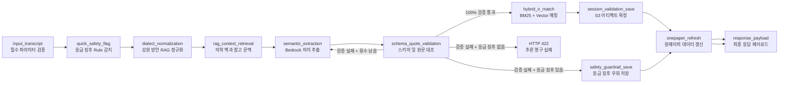

# 문진톡톡 LangGraph AI 문진 파이프라인 아키텍처

본 문서는 환자가 제출한 음성 문진 답변 묶음(Q1~Q4)을 백엔드가 어떠한 상태 전이(State Transition) 순서로 분석하여 **의료진용 원페이퍼**와 **환자 맞춤형 안내문**으로 구조화하는지 명세합니다.

파이프라인의 핵심 구동 코드는 서버리스 환경(`backend/serverless/src/`) 내 다음 5개 모듈로 역할이 엄격히 디커플링되어 있습니다.

```text
orchestration.py       # 비동기 실행 트리거 및 파이프라인 진입점
pipeline_graph.py      # LangGraph 방향성 상태 그래프 및 분기(Edge) 명세
pipeline_nodes.py      # 개별 그래프 노드 단위의 비즈니스 연산 로직
pipeline_state.py      # 그래프 노드 간 공유되는 상태(State) 타입 스키마
pipeline_trace.py      # 단계별 비식별 감사 로그(Trace) 수집기
```

---

## 💡 아키텍처 설계 핵심 사상

문진톡톡은 고령 환자의 비정형 발화 분석을 **'단일 거대 LLM 호출(Single Monolithic LLM Call)'에 의존하지 않습니다.** 환자가 접수처 태블릿에서 Q1~Q4 답변 입력을 완료하면, API 핸들러는 답변 원문을 일괄 저장한 직후 백그라운드 Lambda를 비동기로 호출합니다. 이후 오케스트레이터가 답변 항목들을 순차적으로 LangGraph 그래프 노드에 주입하며 단계별 추론 및 검증을 제어합니다.

```text
[Q1~Q4 일괄 제출] ──> 프론트엔드 즉시 완료 응답 (Non-Blocking UX)
                      └──> Lambda 백그라운드 비동기 추론 시작
                             ├── 1. 입력 정합성 및 필수값 검증
                             ├── 2. Rule 기반 응급 위험 표현 1차 감지
                             ├── 3. 강원 방언 RAG 해독 및 문맥 정규화
                             ├── 4. 도메인 백과 참고 문맥 Retrieval
                             ├── 5. Bedrock Nova 기반 의미 스팬(Span) 추출
                             ├── 6. Pydantic 스키마 및 Quote Grounding 검증
                             │       └── 실패 시: 정합성 복구 프롬프트로 자체 재시도(Retry)
                             ├── 7. 활성 증상에 한해 Hybrid IR 표준 병명 매칭
                             └── 8. 산출물 S3 아티팩트 적재 및 원페이퍼 동기화
```

### LangGraph 기반 파이프라인 도입 타당성
1. **명시적 워크플로우 제어:** 블랙박스 Agent 방식의 예측 불가능성을 배제하고, 모든 연산 단계와 순서를 결정론적 그래프로 시각화합니다.
2. **통합 에러 핸들링:** LLM 추론 실패, 스키마 규격 위반, 안전 플래그 감지가 단일 그래프 상태 안에서 안전 경로로 분기됩니다.
3. **결과 설명 가능성(Explainability) 확보:** 노드 통과 시점마다 최소한의 결정 근거를 Trace 아티팩트로 남겨 의료진의 사후 검증을 지원합니다.

---

## 🔗 LangChain vs LangGraph 역할 분리

현재 MVP 시스템은 LangChain Core와 LangGraph를 결합한 하이브리드 추론 모델을 취합니다.

| 프레임워크 | 주입 경로 | 엔지니어링 역할 및 책임 |
| --- | --- | --- |
| **LangChain Core** | `langchain_prompting.py`<br>`llm.py` | 프롬프트 템플릿 바인딩, Amazon Bedrock 호출 래퍼, JSON 파서를 단일 추론 인터페이스(Runnable Chain)로 압축 |
| **LangGraph** | `pipeline_graph.py`<br>`pipeline_nodes.py` | 체인 노드 간의 상태 전달, 외부 RAG 연동, 스키마 검증기 대조, 조건부 재시도 분기 제어 |

> **설계 요약:** LangChain이 단일 노드 내에서 **'모델에 어떻게 질의하고 규격화된 JSON을 뽑아낼 것인가'** 를 담당한다면, LangGraph는 **'이 노드들을 어떤 조건부 순서로 엮어 의료 사고 없는 안전한 파이프라인을 완주할 것인가'** 를 통제합니다.

---

## 📈 파이프라인 그래프 토폴로지 (Topology)



---

## 🗂️ 핵심 소스 파일 비즈니스 책임

1. **`orchestration.py` (파이프라인 트리거):** API Gateway 비동기 이벤트 핸들러입니다. HTTP 페이로드를 수신하여 S3에 1차 마스킹 적재한 뒤 LangGraph 실행 엔진을 비동기 트리거합니다.
2. **`pipeline_state.py` (상태 계약서):** 노드 간 전송되는 TypedDict 기반 스키마(`AnswerPipelineState`)를 정의합니다. 문진 유형 상수(`SYMPTOM_QUESTION_TYPES`)가 이곳에서 통제됩니다.
3. **`pipeline_graph.py` (라우팅 매니저):** 그래프 노드의 조건부 전이 규칙(`route_after_schema_validation` 등)과 실행 방향성을 컴파일합니다.
4. **`pipeline_nodes.py` (연산 로직 모음):** 실제 LLM 추론, 벡터 검색, Pydantic 검증기가 구동되는 개별 비즈니스 노드 함수 11종을 탑재합니다.
5. **`pipeline_trace.py` (감사 로그 기록기):** 각 노드의 구동 시간, 모델 ID, 파서 해시값을 수집하여 S3 `llm_trace.redacted.json`으로 영구 빌드합니다.

---

## 🔍 노드별 세부 실행 규격

### 1. `input_transcript` (입력 정규화)
* **검증 대상:** `session_id`, `question_id`, `question_type`, `visit_type`, `transcript(원문)`
* **예외 처리:** 필수값 누락 혹은 빈 문자열 입력 시 즉시 `HTTP 400 Bad Request` 반환 후 그래프 종료

### 2. `quick_safety_flag` (선제적 위험 감지)
* **기능:** LLM의 무거운 추론을 기다리기 전, 정규식 기반 Rule 엔진으로 **객혈, 흉통, 심한 호흡곤란** 등의 응급 키워드를 선제 포착합니다.
* **원칙:** 이 단계는 알림 배지 생성을 위한 고속 패스이며, 정밀 증상 추출 로직을 대체하지 않습니다.

### 3. `dialect_normalization` (사투리 해독)
* **기능:** 강원 권역 방언 사전(`dialect_kangwon.csv`)을 RAG로 대조하여 고령 환자의 구어체를 표준어 후보로 해독합니다.
* **보안 제약:** 사투리 해독 힌트가 생성되더라도 `source_quote`는 반드시 환자가 실제로 발화한 원문 글자 그대로를 유지해야 합니다.

### 4. `rag_context_retrieval` (의학 문맥 주입)
* **기능:** 추출 단서와 일치하는 서울아산병원 질병백과 본문(`diseases_cleaned.json`)의 표준 정의를 참조 문맥으로 주입합니다.
* **통제 원칙:** LLM은 주입된 백과 본문 내용만 보고 환자가 말하지도 않은 합병증이나 검사 항목을 임의 생성할 수 없습니다.

### 5. `semantic_extraction` (구조화 추론)
* **기능:** Amazon Bedrock Nova Pro 모델을 구동하여 발화 내 증상 스팬, 임상 경과 단서, 환자 질문 항목을 추출합니다.
* **통제 원칙:** 모델 자의적인 진단 점수(`score`) 생성을 원천 차단합니다.

### 6. `schema_quote_validation` (정합성 대조기)
LLM 생성 출력을 Pydantic 스키마 및 원문 대조 엔진으로 대조합니다.
* **검증 통과 시:** `hybrid_ir_match` 노드로 진입
* **검증 실패 시 (재시도 남음):** 에러 로그를 포함한 보구 프롬프트(`repair_note`)를 생성하여 `semantic_extraction` 노드로 반환 (재추론 루프)
* **최종 실패 시 (응급 징후 존재):** `safety_guardrail_save` 노드로 우회하여 에러 데이터 대신 위험 배지만 원페이퍼에 강제 적재
* **최종 실패 시 (응급 징후 없음):** `HTTP 422 Unprocessable Entity` 던짐

### 7. `hybrid_ir_match` (표준 증상 매핑)
* **트리거 조건:** 질문 유형이 `chief_complaint`, `progress`, `new_symptoms`인 증상 문항에 한해 구동 (복약·환자질문 문항은 스킵)
* **매칭 공식:** $\text{BM25 Sparse Score} + \text{Titan Vector Similarity} + \text{Label Direct Signal}$ 융합 스코어가 유효 임계값을 통과할 경우 최종 표준 증상(`matched_slots`)으로 바인딩

### 8~11. 산출물 확정 노드 그룹
* **`session_validation_save`:** 검증된 스팬과 정제 JSON을 S3 `answers.redacted.json`으로 아카이빙합니다.
* **`onepaper_refresh`:** 원페이퍼 JSON 스키마를 재조립하여 의료진 대기열 화면에 동기화 트리거를 보냅니다.
* **`response_payload`:** 프론트엔드 태블릿에 반환할 최종 상태 페이로드를 패킹합니다.

---

## ⚖️ LLM vs Hybrid IR 책임 경계

의료 보조 시스템의 신뢰성을 담보하기 위해 두 엔진의 역할을 흑백으로 분리합니다.

| 구분 | LLM (의미 추론 엔진) | Hybrid IR (표준 매칭 엔진) |
| :---: | --- | --- |
| **핵심 역할** | 환자의 발화를 의미 단위로 분리하고, 구어체를 표준어로 다듬으며, 인용 원문(`source_quote`)을 지정 | LLM이 뽑은 후보 키워드를 공신력 있는 병원 질병백과 인덱스 대조군과 매핑 |
| **금지 영역** | 임의의 의학적 진단명 확정, 처방 지시, 허위 확신도 수치(`confidence`) 생성 | 환자 발화 원문의 맥락 자의적 해석 및 문장 요약 |

---

## 🛡️ IR 진입 전 선행 상태 필터링

LLM이 포착한 증상 키워드라 할지라도 모두 IR 검색 엔진으로 투입되지 않습니다. 파이프라인의 `clinical_state.py`는 속성 기반의 라우팅 필터를 선행 구동합니다.

| 추출 스팬 상태 속성 | IR 투입 여부 | 아키텍처 제어 논리 |
| --- | :---: | --- |
| `status="있음"` + 활성 증상 유형 | **진입 허용** | 원페이퍼의 **[오늘 호소 증상 카드]** 매칭 후보군 |
| `symptom_absent` + `status="없음"` | **진입 차단** | 환자가 "열은 없어요"라고 명시한 부재 데이터 $\rightarrow$ 단서 영역 격리 |
| `progress_improved` + `status="없음"`| **진입 차단** | "기침은 싹 낫다" 등 호전 데이터 $\rightarrow$ 금일 집중 문진 대상에서 제외 |

*(임상 예시: "두통은 싹 없어졌고 아직 숨만 좀 가빠요"라는 발화 수신 시, '두통'은 호전 단서로만 아카이빙되며 IR 검색 파이프라인에는 '숨 가쁨' 스팬 단 하나만 투입되어 표준 병명(호흡곤란) 매칭을 수행합니다.)*

---

## 🔄 한계 보구 및 재시도(Retry) 정책

런타임 파이프라인 환경 변수 제어값:
```text
EXTRACTION_RETRY_ATTEMPTS = 3
REVIEW_RETRY_ATTEMPTS = 2
```

**추론 재시도 트리거 조건:**
* JSON 포맷 파싱 에러 혹은 Pydantic 필수 스키마 필드 누락
* 열거형(Enum) 규격 외의 임의 문자열 할당 시도
* 추출된 `source_quote`가 환자 원문 문자열 내에 실재하지 않는 환각(Hallucination) 상태
* 증상 확인 문항임에도 유효 스팬 리스트가 빈 배열`[]`로 반환된 경우

> ⚠️ **엔지니어링 원칙:** 지정된 재시도 횟수를 모두 소모하고도 통과하지 못하면 **규칙 기반(Rule-based) 텍스트로 조용히 위장하여 대체하지 않습니다.** 의료 정합성이 결려된 데이터는 데이터베이스를 오염시키지 않고 차단(HTTP 422)하는 것이 시스템의 대원칙입니다.
