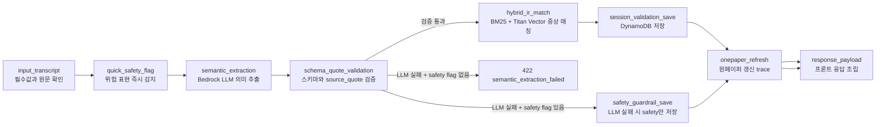

# LangGraph 문진 처리 파이프라인

이 문서는 환자 답변 1개가 백엔드에서 어떤 순서로 처리되는지 설명합니다.

실제 실행 코드는 다음 파일에 나뉘어 있습니다.

```text
backend/serverless/src/orchestration.py
backend/serverless/src/pipeline_graph.py
backend/serverless/src/pipeline_nodes.py
backend/serverless/src/pipeline_state.py
backend/serverless/src/pipeline_trace.py
```

---

## 먼저 알아야 할 핵심

문진톡톡은 환자 답변을 한 번에 모든 것을 처리하는 black box로 만들지 않습니다.

대신 답변 1개가 아래 노드를 순서대로 지나가고, 각 노드가 남긴 결과를 trace로 저장합니다.

```text
환자 답변 텍스트
  -> 입력 검증
  -> 안전 표현 1차 감지
  -> LLM 의미 추출
  -> fixed schema와 quote 검증
  -> 증상 문항이면 Hybrid IR
  -> DynamoDB 저장
  -> 원페이퍼 갱신
  -> 프론트 응답
```

이 구조를 LangGraph로 명시한 이유는 다음과 같습니다.

- 처리 단계가 눈에 보여야 함
- LLM 실패와 안전 분기가 분명해야 함
- 각 단계의 입력과 결과를 trace로 남겨야 함
- 나중에 dialect RAG, 추가 validator, review node를 붙이기 쉬워야 함

---

## LangChain과 LangGraph의 차이

현재 MVP는 LangChain과 LangGraph를 모두 사용합니다.

| 기술 | 사용하는 위치 | 하는 일 |
| --- | --- | --- |
| LangChain Core | `langchain_prompting.py` | Bedrock에 보낼 prompt/message를 정리 |
| LangGraph | `pipeline_graph.py`, `pipeline_nodes.py` | 문항 처리 순서, 조건 분기, trace 관리 |

쉽게 말하면:

```text
LangChain = LLM에게 어떻게 물어볼지 정리하는 도구
LangGraph = 여러 처리 단계를 어떤 순서로 실행할지 정리하는 도구
```

---

## 전체 노드 흐름



---

## 파일별 책임

### `orchestration.py`

`/process-answer`의 진입점입니다.

```python
def process_answer(body):
    return run_answer_pipeline(body)
```

이 파일은 일부러 얇게 유지합니다. 실제 파이프라인은 `pipeline_graph.py`와 `pipeline_nodes.py`에 있습니다.

### `pipeline_state.py`

LangGraph 상태 타입과 그래프 설명을 담습니다.

주요 내용:

- `AnswerPipelineState`
- `SYMPTOM_QUESTION_TYPES`
- `PIPELINE_GRAPH`

이 파일을 보면 파이프라인 전체에서 어떤 값이 오가는지 알 수 있습니다.

### `pipeline_graph.py`

노드 연결과 조건 분기만 담당합니다.

포함 내용:

- `run_answer_pipeline()`
- `pipeline_graph_description()`
- `route_after_required_input()`
- `route_after_schema_validation()`
- `route_after_save()`
- `_compiled_graph()`

이 파일은 “흐름 지도”입니다.

### `pipeline_nodes.py`

실제 처리 함수가 모여 있습니다.

포함 노드:

- `input_transcript_node`
- `quick_safety_flag_node`
- `semantic_extraction_node`
- `schema_quote_validation_node`
- `hybrid_ir_match_node`
- `session_validation_save_node`
- `safety_guardrail_save_node`
- `onepaper_refresh_node`
- `response_payload_node`

### `pipeline_trace.py`

trace와 orchestration metadata를 담당합니다.

포함 내용:

- `trace_update()`
- `next_trace_entry()`
- `orchestration_snapshot()`
- `response_errors()`
- `persist_final_trace()`

---

## 노드별 상세 설명

### 1. `input_transcript`

입력 body에서 필수값을 꺼냅니다.

필수값:

- `session_id`
- `question_id`
- `question_type`
- `visit_type`
- `transcript`

실패 조건:

- 필수값 누락: 400 `missing_required_fields`
- 빈 transcript: 400 `empty_transcript`

trace 예시:

```json
{
  "node": "input_transcript",
  "status": "passed",
  "details": {
    "question_id": "Q1",
    "question_type": "chief_complaint",
    "visit_type": "initial",
    "transcript_chars": 20
  }
}
```

### 2. `quick_safety_flag`

LLM 호출 전 위험 표현을 1차 감지합니다.

예:

- 객혈
- 피 섞인 가래
- 심한 호흡곤란
- 흉통

이 단계는 빠른 안전 감지를 위한 rule입니다. 증상 extraction을 대체하지 않습니다.

trace 예시:

```json
{
  "node": "quick_safety_flag",
  "status": "clear",
  "details": {
    "has_flag": false,
    "flag_type": null,
    "matched_pattern": null
  }
}
```

### 3. `semantic_extraction`

Bedrock Nova를 호출하여 환자 답변을 fixed JSON으로 구조화합니다.

하는 일:

- 구어체/사투리 표현 표준화
- 의미 단위 span 분리
- Q4 환자 질문 분리
- clinical clues 추출
- source_quote 보존

사용 파일:

```text
extraction.py
extraction_prompts.py
extraction_schema.py
schemas/extraction.py
llm.py
langchain_prompting.py
```

중요:

- LLM은 임의 score를 만들 수 없습니다.
- `source_quote`는 환자 원문 substring이어야 합니다.
- schema 검증 실패 시 retry합니다.

trace 예시:

```json
{
  "node": "semantic_extraction",
  "status": "passed",
  "details": {
    "method": "bedrock_nova",
    "model_id": "apac.amazon.nova-pro-v1:0",
    "attempts": 1,
    "validation_error_count": 0,
    "span_count": 2,
    "structured_keys": ["clinical_clues", "questions", "standardized_text", "unresolved_items"]
  }
}
```

### 4. `schema_quote_validation`

`semantic_extraction`의 결과를 보고 다음 경로를 결정합니다.

분기:

| 조건 | 다음 경로 |
| --- | --- |
| LLM 검증 성공 | `hybrid_ir_match` |
| LLM 검증 실패 + safety flag 있음 | `safety_guardrail_save` |
| LLM 검증 실패 + safety flag 없음 | 422 반환 |

이 단계는 이미 `extraction.py`에서 retry가 끝난 결과를 기준으로 판단합니다.

### 5. `hybrid_ir_match`

증상 문항일 때만 실행됩니다.

IR 대상 question type:

```text
chief_complaint
progress
new_symptoms
```

비증상 문항이면 skip:

- 복약 문항
- 환자 질문 문항
- Q4 agenda 문항

Hybrid IR 계산:

```text
BM25 lexical score
+ Titan vector similarity
+ 표준 증상명/alias 직접 일치 signal
-> threshold 통과 시 matched_slots 확정
```

trace 예시:

```json
{
  "node": "hybrid_ir_match",
  "status": "matched",
  "details": {
    "method": "bm25_titan_hybrid",
    "matched_count": 2,
    "unmatched_count": 0
  }
}
```

### 6. `session_validation_save`

검증된 문항 결과를 DynamoDB에 저장합니다.

저장되는 위치:

- `responses.Qx`
- `question_results.Qx`
- `onepager`

저장 payload에는 다음이 포함됩니다.

- 원문 transcript
- LLM spans
- structured data
- matched_slots
- llm_meta
- orchestration snapshot
- pipeline_trace

### 7. `safety_guardrail_save`

LLM extraction이 실패했지만 safety flag가 있을 때 실행됩니다.

이 분기는 잘못된 LLM JSON을 저장하지 않습니다. 대신 환자 안전과 관련된 flag만 저장하여 직원이나 의료진이 확인할 수 있게 남깁니다.

사용 예:

```text
환자 발화: "피가 나와요"
LLM schema 실패
하지만 quick_safety_flag에서 객혈 의심 감지
-> safety_guardrail_save
```

### 8. `onepaper_refresh`

저장 단계에서 원페이퍼가 갱신되었음을 trace에 남깁니다.

실제 원페이퍼 조립은 `validate_and_save()` 내부에서 수행되며, 이 노드는 파이프라인 설명 가능성을 위해 존재합니다.

### 9. `response_payload`

프론트에 반환할 JSON을 조립합니다.

응답에 포함되는 주요 필드:

- `spans`
- `structured`
- `matched_slots`
- `unmatched_spans`
- `validator_passed`
- `safety_flag`
- `errors`
- `onepager_ready`
- `orchestration`

---

## 정상 응답 예시

입력:

```json
{
  "session_id": "s_...",
  "question_id": "Q1",
  "question_type": "chief_complaint",
  "visit_type": "initial",
  "transcript": "어제부터 목이 칼칼하고 코가 막혀요."
}
```

응답 일부:

```json
{
  "validator_passed": true,
  "spans": [
    {
      "source_quote": "목이 칼칼하고",
      "type": "symptom",
      "slot_ref": "throat_irritation",
      "name": "목 자극감",
      "normalized_text": "목 자극감",
      "status": "있음",
      "alert": false,
      "explain": "환자가 목의 칼칼함을 직접 호소했습니다."
    }
  ],
  "matched_slots": [
    {
      "slot_id": "throat_irritation",
      "name": "목의 통증",
      "score": 0.9,
      "source_quote": "목이 칼칼하고"
    }
  ],
  "orchestration": {
    "graph": "munjin_langgraph_answer_pipeline",
    "version": "v1",
    "active_path": [
      "input_transcript",
      "quick_safety_flag",
      "semantic_extraction",
      "schema_quote_validation",
      "hybrid_ir_match",
      "session_validation_save",
      "onepaper_refresh",
      "response_payload"
    ]
  }
}
```

---

## 실패 응답 예시

LLM이 schema나 quote 검증을 끝까지 통과하지 못하면 저장하지 않습니다.

```json
{
  "error": "semantic_extraction_failed",
  "message": "LLM schema/quote validation failed after retries.",
  "llm_meta": {
    "model_id": "apac.amazon.nova-pro-v1:0",
    "attempts": 3,
    "retry_loop": "schema_quote_repair",
    "validation_errors": [
      {
        "field": "spans.0.source_quote",
        "type": "value_error",
        "message": "quote must be an exact substring of the patient answer"
      }
    ]
  }
}
```

---

## DynamoDB에서 확인할 위치

세션 item:

```json
{
  "responses": {
    "Q1": {
      "text": "어제부터 목이 칼칼하고 코가 막혀요.",
      "spans": [],
      "matched_slots": [],
      "structured": {},
      "llm_meta": {},
      "orchestration": {},
      "pipeline_trace": []
    }
  },
  "question_results": {
    "Q1": {}
  },
  "onepager": {}
}
```

확인 포인트:

- `responses.Qx.text`: 환자 원문
- `responses.Qx.spans`: LLM extraction 결과
- `responses.Qx.matched_slots`: IR 매칭 결과
- `responses.Qx.pipeline_trace`: 실제 노드 실행 기록
- `responses.Qx.orchestration.active_path`: 노드 경로 요약

---

## LLM과 IR의 경계

이 부분이 가장 중요합니다.

### LLM이 하는 일

- 환자 발화를 의미 단위로 나눔
- 구어체를 표준 한국어로 정리
- 증상 후보 span을 추출
- 환자 질문을 agenda 후보로 분리
- source_quote와 explain을 작성

### LLM이 하지 않는 일

- 최종 증상 score 생성
- IR 점수 생성
- 표준 증상 확정
- 진단 또는 처방
- 환자 원문에 없는 사실 생성

### IR이 하는 일

- LLM이 낸 증상 후보를 표준 증상 인덱스와 비교
- BM25와 Titan vector similarity 계산
- label/alias 직접 일치 신호 반영
- threshold 통과 여부 판단
- `matched_slots`와 `unmatched_spans` 생성

---

## 현재 retry 정책

환경 변수:

```text
EXTRACTION_RETRY_ATTEMPTS=3
REVIEW_RETRY_ATTEMPTS=2
```

Extraction retry는 다음 경우에 발생합니다.

- JSON 형식 오류
- schema 필드 누락
- enum 값 오류
- extra field 존재
- `source_quote`가 원문에 없음
- 증상 문항인데 grounded span이 비어 있음

Retry 후에도 실패하면 rule-based로 조용히 대체하지 않습니다. `ALLOW_RULE_FALLBACK=false`가 기본입니다.

---

## 앞으로 확장할 수 있는 지점

| 확장 | 붙일 위치 |
| --- | --- |
| 강원 방언 RAG | `semantic_extraction` 앞 또는 `extraction_prompts.py` |
| 추가 안전 flag | `clinical_terms.py`, `quick_safety_flag_node` |
| 의사 review node 분리 | `onepaper_review.py`, 새 LangGraph node |
| RAG retriever | `langchain_prompting.py` 또는 별도 retriever 모듈 |
| tracing dashboard | `pipeline_trace.py`, DynamoDB trace 필드 |
| 인증/권한 분기 | `handler.py`, API Gateway authorizer |

---

## 관련 문서

- [프로젝트 구조](PROJECT_STRUCTURE.md)
- [내부 JSON 스키마](DATA_SCHEMA.md)
- [서버리스 백엔드 README](../backend/serverless/README.md)
