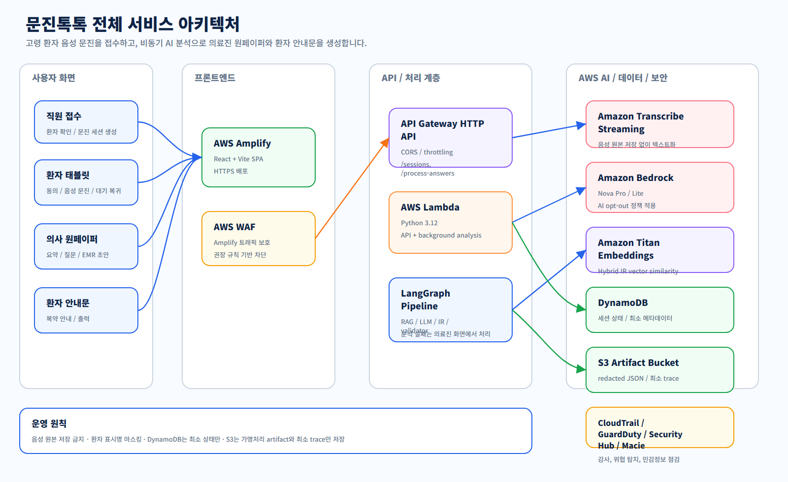

# 문진톡톡 문서 모음

이 폴더는 문진톡톡의 구조, 데이터, 배포, 보안, 평가 방법을 설명하는 기술 문서 모음입니다. 해커톤 평가자는 서비스가 실제로 어떻게 동작하는지 확인할 수 있고, 개발자는 배포와 유지보수에 필요한 세부 정보를 확인할 수 있습니다.

---

## 평가자 추천 읽기 순서

| 순서 | 문서 | 확인할 내용 |
| --- | --- | --- |
| 1 | [../README.md](../README.md) | 문제 정의, 서비스 흐름, 핵심 기술, 보안 요약 |
| 2 | [LANGGRAPH_PIPELINE.md](LANGGRAPH_PIPELINE.md) | 환자 답변이 원페이퍼로 바뀌는 AI 파이프라인 |
| 3 | [DATA_SCHEMA.md](DATA_SCHEMA.md) | DynamoDB, S3, 원페이퍼, 안내문 JSON 구조 |
| 4 | [SECURITY_DATA_INVENTORY.md](SECURITY_DATA_INVENTORY.md) | 어떤 데이터가 어디에 저장되고 어떻게 보호되는지 |
| 5 | [PROJECT_STRUCTURE.md](PROJECT_STRUCTURE.md) | 코드 폴더와 주요 파일의 책임 |

---

## 개발자 추천 읽기 순서

| 순서 | 문서 | 확인할 내용 |
| --- | --- | --- |
| 1 | [../frontend/README.md](../frontend/README.md) | 프론트 화면 구조, STT 흐름, API 호출 방식 |
| 2 | [../backend/README.md](../backend/README.md) | 백엔드 책임 범위, LangGraph, Hybrid IR |
| 3 | [../backend/serverless/README.md](../backend/serverless/README.md) | SAM 배포, 환경 변수, AWS 콘솔 설정 |
| 4 | [../backend/serverless/src/data/README.md](../backend/serverless/src/data/README.md) | 공개 저장소에 없는 런타임 데이터 배치 |
| 5 | [../evaluation/ir/README.md](../evaluation/ir/README.md) | IR/Linker 평가 실행과 결과 해석 |

---

## 문서 목록

| 파일 | 역할 |
| --- | --- |
| [LANGGRAPH_PIPELINE.md](LANGGRAPH_PIPELINE.md) | LangGraph 노드, LLM 호출, 검증, IR, retry 경로 |
| [DATA_SCHEMA.md](DATA_SCHEMA.md) | 세션, 답변, 원페이퍼, 안내문, trace schema |
| [SECURITY_DATA_INVENTORY.md](SECURITY_DATA_INVENTORY.md) | 개인정보/민감정보 저장 위치와 보관 정책 |
| [DEPLOYMENT.md](DEPLOYMENT.md) | AWS 배포 절차와 운영 설정 |
| [MVP_SETUP.md](MVP_SETUP.md) | 로컬 실행과 시연 준비 |
| [PROJECT_STRUCTURE.md](PROJECT_STRUCTURE.md) | 전체 코드 구조와 파일별 책임 |
| [readme-assets/PLACE_IMAGES_HERE.md](readme-assets/PLACE_IMAGES_HERE.md) | README용 화면 이미지 배치 안내 |

---

## 아키텍처 구조도

아래 구조도는 README와 발표자료에 바로 넣을 수 있도록 PNG와 SVG를 함께 보관합니다. PNG는 문서 삽입용, SVG는 수정 가능한 원본입니다.

| 구조도 | 설명 |
| --- | --- |
| [전체 서비스 아키텍처](architecture-diagrams/overall-service-architecture.png) | 프론트엔드, API Gateway, Lambda, LangGraph, Bedrock, Transcribe, DynamoDB, S3의 전체 연결 |
| [환자 문진 UX 흐름](architecture-diagrams/patient-questionnaire-flow.png) | 접수부터 태블릿 문진 완료, 대기열 복귀까지의 사용자 흐름 |
| [백엔드 비동기 처리 흐름](architecture-diagrams/backend-async-flow.png) | `/process-answers` 저장 후 Lambda async 분석으로 분리되는 구조 |
| [LangGraph AI 파이프라인](architecture-diagrams/langgraph-pipeline.png) | RAG, 표준화, 의미 추출, schema 검증, IR, 원페이퍼 생성 흐름 |
| [Hybrid IR 표준 증상 매칭](architecture-diagrams/hybrid-ir-flow.png) | BM25, Titan Vector, label signal, RRF, linker validator의 표준 증상 연결 |
| [데이터 저장과 보안 처리](architecture-diagrams/data-security-flow.png) | 음성 미저장, 가명처리, S3 redacted artifact, DynamoDB pointer, AWS 보안 설정 |

---

## 문서 작성 기준

- 해커톤 제출 문서는 “무엇을 만들었는가”보다 “왜 그렇게 설계했는가”가 보이도록 작성합니다.
- 의료 데이터 설명은 저장 위치, 보관 기간, 접근 경로, 비공개 처리 기준을 함께 적습니다.
- AI 설명은 모델 이름보다 입력, 출력, validator, 실패 처리 경로를 먼저 적습니다.
- 구현 예정이거나 아이디어 단계인 내용은 실제 구현 내용과 섞지 않습니다.
- 로컬 평가 데이터, 환자 발화 원문, 비공개 원천 데이터 경로는 공개 문서에 넣지 않습니다.

---

## 최신 구현 기준

현재 문진 기본 흐름은 Q1~Q4 답변을 모두 받은 뒤 `/process-answers`로 일괄 저장하고, 백그라운드 Lambda가 LangGraph 분석을 수행하는 구조입니다. 문항마다 LLM 분석을 기다리는 구조가 아닙니다.

문서에서 `/process-answer`가 언급되는 경우는 단일 문항 처리 호환 endpoint 또는 회귀 검증 설명으로만 해석해야 합니다.
