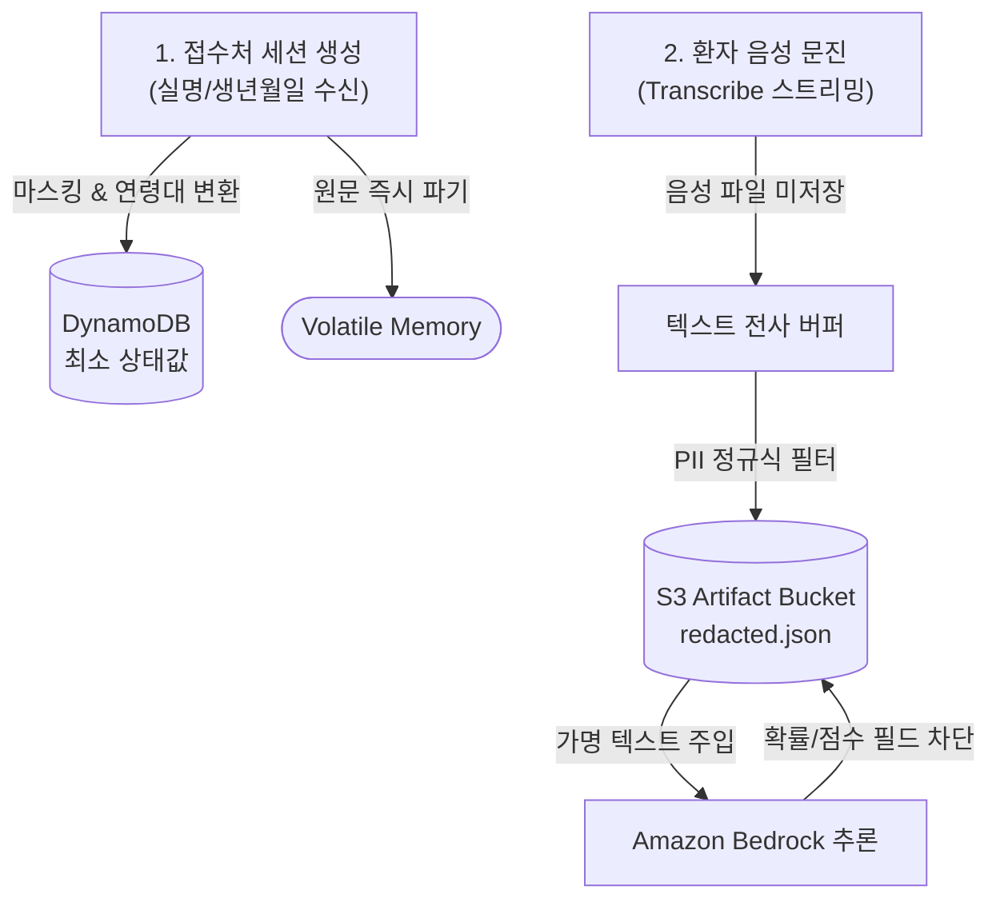

# 문진톡톡 데이터 보안 인벤토리 및 스토리지 거버넌스

본 문서는 문진톡톡 MVP 파이프라인 전반에서 생성, 가공, 저장, 파기되는 모든 데이터의 **필드 단위 민감도 분류와 스토리지별 격리 경계(Data Boundary)** 를 규정하는 보안 설계 명세서입니다.

음성 인식(STT), LLM 의미 추출, Hybrid IR 증상 매칭을 다루는 솔루션 특성상 "인프라 레벨의 암호화"만으로는 의료 데이터의 안전성을 입증할 수 없습니다. 따라서 본 인벤토리는 **어떤 필드가 직접식별자(PII)인지, 어떤 건강정보가 LLM으로 전송되는지, 어떤 데이터가 영구 삭제되는지**를 결정론적으로 통제합니다.

---

## 1. 스토리지 격리 핵심 원칙

| 스토리지 레이어 | 핵심 역할 | 저장되는 데이터 예시 | 거버넌스 통제 로직 |
| --- | --- | --- | --- |
| **Amazon DynamoDB** | 고속 대기열 및 세션 상태 허브 | `session_id`, `status`, 대기 순번, 마스킹 환자명(`김*동`), 연령대(`70대`), 성별, 진료과, S3 참조 포인터 | **PII 원문 비저장 원칙:** 실명, 생년월일, 연락처, 답변 원문 직접 저장 원천 차단 |
| **Amazon S3** | 비식별 문진 산출물 아카이브 | `answers.redacted.json`, `onepaper.redacted.json`, `patient_guide.redacted.json`, 최소 `llm_trace.redacted.json` | **Sanitization 강제:** 적재 직전 정규식 기반 마스킹(`privacy.py`) 및 Lifecycle(3일 후 파기) 적용 |
| **Volatile Memory**| 파이프라인 런타임 스트리밍 | 실시간 웹소켓 STT 버퍼, LLM 프롬프트 조립 메모리 | 추론 완료 즉시 메모리 할당 해제(휘발) |
| **Zero-Storage** | **영구 저장 금지 대상** | 환자 음성 원본 파일(`.wav`/`.mp3`), 주민등록번호, 연락처 원문 | 인프라 내 물리 드라이브 적재 원천 금지 |

---

## 2. 필드 단위 민감도 분류 매트릭스

기존 단일 테이블 직접 저장 방식(Legacy direct storage)을 완전 폐기했으며, 현행 애플리케이션 코드는 아래의 분리 규격을 100% 강제합니다.

| 필드명 | 데이터 민감도 | 대상 스토리지 | 보호 및 파기 메커니즘 |
| --- | :---: | --- | --- |
| `session_id`, `queue_number`, `status` | 일반 | DynamoDB | 세션 생명주기(TTL) 동기화 |
| `patient.name` | PII (단별) | DynamoDB | 세션 생성 시 `김*동` 형태로 단방향 마스킹 치환 |
| `patient.full_name` | **고위험 PII** | *메모리 휘발* | 현장 접수 입력 직후 마스킹 표기명 추출 후 즉시 메모리 파기 |
| `patient.birth_date` | **고위험 PII** | *메모리 휘발* | 만 나이 및 연령대(`70대`) 추출 직후 즉시 파기 |
| `patient.phone` | **고위험 PII** | **수집 금지** | MVP 데이터 파이프라인 입력 원천 차단 |
| `patient.receipt_id` | 조건부 PII | DynamoDB | 병원 실접수번호일 경우 내부 무작위 세션 난수로 해시 대체 |
| `privacy_consent` | 법적 동의 | DDB / S3 | DDB엔 수락 여부 요약만 기록, 전문은 S3 `consent.json` 격리 |
| `responses.Qx.text` | 민감 건강정보 | S3 Artifact | DB 적재 금지 $\rightarrow$ `privacy.py` 가명 처리 후 S3 객체 보관 |
| `source_quote`, `spans` | 민감 건강정보 | S3 Artifact | 원문 대조용 보관. 내부에 포함된 식별 어휘 선행 마스킹 |
| `matched_slots` | 민감 건강정보 | S3 Artifact | 표준 매칭 JSON 아카이빙 (DDB엔 `matched_count` 숫자만 남김) |
| `onepager`, `patient_guide`| 종합 건강정보 | S3 Artifact | 의료진/환자 열람용 최종 정제 본문 S3 전용 적재 |
| `rank_score`, `probability`| 내부 스코어 | *완전 폐기* | 의료진 혼선 방지를 위해 운영 산출물 및 UI에서 전면 삭제 |
| `events`, `llm_meta` | 감사 로그 | S3 Trace | 원문이 제거된 추론 노드 이벤트만 `llm_trace.redacted.json` 보관 |

---

## 3. 파이프라인 단계별 데이터 전수조사



1. **[접수 세션 생성]**: 직원이 입력한 환자 정보는 `create_session` 핸들러에서 식별자를 가명화합니다. `full_name`, `phone`은 DB 스키마에 존재하지 않습니다.
2. **[음성 스트리밍]**: 브라우저 오디오 스트림은 AWS Transcribe로 직접 바인딩되며, 중간 백엔드 서버에 임시 오디오 파일을 생성하지 않습니다.
3. **[의미 구조화 추론]**: Bedrock 호출 시 `llm.py`는 전송 페이로드에서 직접식별자를 선행 제거합니다. 또한 AWS AI Services Opt-out 정책에 의해 환자 데이터는 모델 학습에 이용되지 않습니다.
4. **[결과 조립 및 반환]**: 클라이언트가 `/sessions/{id}` 호출 시 API는 S3에 격리된 비식별 JSON 아티팩트를 패치하여 렌더링합니다.

---

## 4. 표준 스토리지 적재 레이아웃

### [S3] 비식별 아티팩트 버킷 규격
```text
sessions/YYYY-MM-DD/{session_id}/
  ├── consent.json                    # 법적 동의서 전문
  ├── answers.redacted.json           # 가명 처리된 문항 답변 및 Spans
  ├── onepaper.redacted.json          # 의료진용 원페이퍼 본문
  ├── doctor_review.redacted.json     # 의사 소견 및 지시사항
  ├── patient_guide.redacted.json     # 환자 맞춤형 쉬운 안내문
  └── llm_trace.redacted.json         # 추론 경로 비식별 감사 로그
```

### [DynamoDB] 세션 아이템 스냅샷 (`MunjinSessions`)
```json
{
  "session_id": "s_1781000000000_ab12cd",
  "queue_number": 3,
  "status": "waiting_doctor",
  "visit_type": "initial",
  "risk": "none",
  "patient": {
    "name": "김*동",
    "age": 75,
    "age_band": "70대",
    "gender": "여성",
    "department": "이비인후과",
    "doctor": "이민우"
  },
  "artifact": {
    "bucket": "<artifact-bucket-name>",
    "prefix": "sessions/2026-06-08/s_1781000000000_ab12cd/",
    "onepaper_key": "sessions/.../onepaper.redacted.json"
  },
  "expires_at": 1781000000
}
```

---

## 5. 사후 감사 메커니즘 (Amazon Macie)

Amazon Macie는 파이프라인 내부의 데이터를 실시간 마스킹하는 도구가 아닙니다. **S3 버킷에 최종 적재된 아티팩트의 무결성을 사후 검증하는 자동화된 감사관(Auditor)** 역할을 수행합니다.

* **감사 프로세스:** `Lambda 가명 처리 적재` $\rightarrow$ `S3 객체 생성` $\rightarrow$ `Macie 백그라운드 스캔` $\rightarrow$ `미등록 PII(전화번호/주민번호 패턴) 감지 시 Security Finding 발생`
* **통제 사상:** 인라인(Inline) 마스킹 차단은 애플리케이션의 `privacy.py`와 Pydantic Validator가 1차 전담하며, Macie는 코드 레벨의 정규식 누락 버그를 잡아내는 2차 방어선입니다.

---

## 6. 인프라 보안 컴플라이언스 점검 매트릭스

현행 코드베이스의 통제 로직과 AWS 제출 콘솔 환경에서 동기화되어야 할 보안 인프라 체크리스트입니다.

| 통제 대상 리소스 | 현재 코드 반영 상태 (Application Level) | AWS 클라우드 운영 점검 항목 (Console / IAM) |
| --- | --- | --- |
| **Amazon S3** | 프론트엔드 Direct Access 차단 (Lambda 인터페이스 경유) | 버킷 `Block Public Access` 전체 활성화 확인 |
| **S3 Encryption**| 적재 코드 내 SSE-S3 / SSE-KMS 헤더 결정론적 주입 | 파라미터 `S3KmsKeyId` 고객 관리형 키 ARN 대조 |
| **S3 Retention** | 세션별 고유 Prefix로 아티팩트 파티셔닝 | `sessions/` 경로 대상 **Lifecycle 3일 후 영구 삭제** 규칙 |
| **DynamoDB** | 만료 시간 스키마 속성(`expires_at`) 빌드 적용 | 테이블 **TTL 활성화** 및 삭제 방지(Protection) 설정 |
| **Bedrock / STT**| 호출 페이로드 내 음성 파일 및 실명 원문 완전 배제 | AWS Organizations **AI Services Opt-out** 정책 켜기 |
| **CloudWatch Log**| 핸들러 내 환자 발화 원문 텍스트 로깅 전면 금지 | 로그 그룹 데이터 보존 주기 **3~7일 단축** 강제 |
| **API Gateway** | 접근 코드 기반 인증 및 세션 JWT 대조 미들웨어 적용 | Stage Throttling(Rate Limit) 및 WAF 연동 |

---

## 7. 자동화된 보안 회귀 검증

코드 변경 시 보안 경계가 무너지지 않도록 Pytest 기반의 컴플라이언스 회귀 테스트가 구동됩니다.

```powershell
cd backend/serverless
python -m pytest tests/test_schema_and_artifact_policy.py -q
```

* **핵심 검증 대상:** DDB 세션 레코드에 금지된 키(`full_name`, `responses`) 생성 시도 차단 여부, S3 적재 페이로드의 정규식 마스킹 정상 작동 여부, LLM 스코어 필드 폐기 여부.
